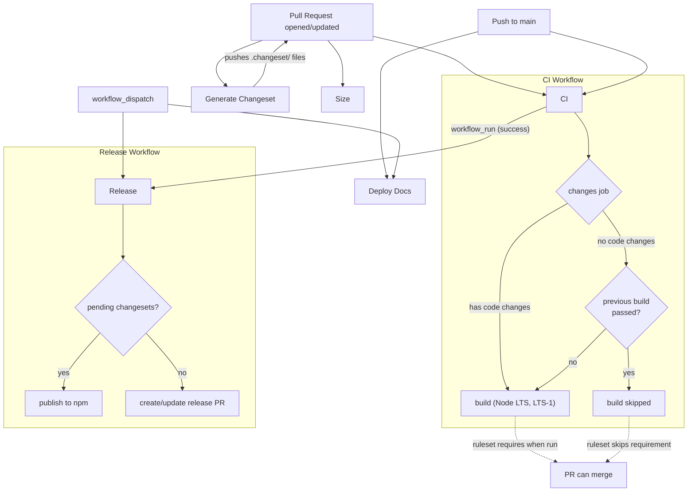
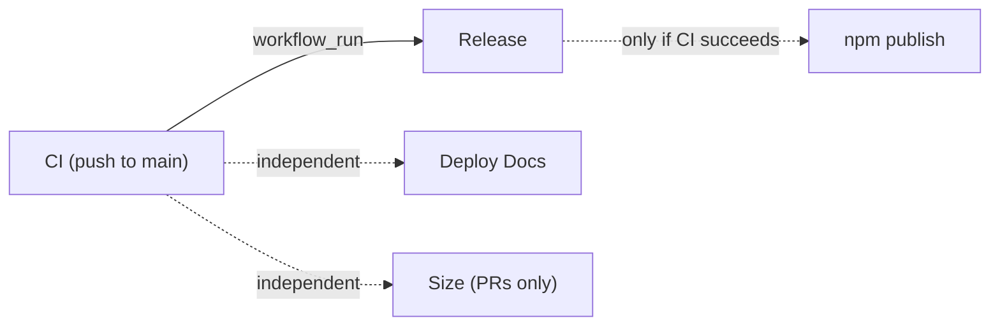

# CI/CD Workflows

## Flow Overview



## Repository Ruleset

Branch protection uses a **repository ruleset** (not legacy branch protection rules) with `strict_required_status_checks_policy: false`. This means:

- When `build` jobs **run**, they must pass to merge
- When `build` jobs are **skipped** (non-code changes), they are not required — PR can merge

Required status checks: `build (lts/*)` and `build (lts/-1)`. Repository admins can bypass.

> **Ruleset name:** `Main Branch CI` — manage at Settings > Rules > Rulesets

## Workflows

| Workflow | File | Triggers | Purpose |
|----------|------|----------|---------|
| **CI** | `ci.yml` | push to `main`, pull requests | Build, typecheck, lint, test across Node LTS and LTS-1 |
| **Release** | `release.yml` | after CI succeeds on `main`, manual | Publish packages to npm via changesets |
| **Deploy Docs** | `docs.yml` | push to `main`, manual | Build and deploy Starlight docs to GitHub Pages |
| **Size** | `size.yml` | pull requests | Bundle size reporting via size-limit |
| **Generate Changeset** | `changeset.yml` | pull requests (opened, synchronize) | Auto-generate changeset files with Copilot enhancement |

## Path Filtering

Workflows skip when **all** changed files match the ignore list. If even one file falls outside the list, the workflow runs.

### CI (`ci.yml`)

| Ignored Path | Reason |
|---|---|
| `.changeset/**` | Release metadata, not code |
| `.claude/**` | AI skill definitions |
| `docs/**` | Docs have their own deploy workflow |
| `scripts/**` | Utility scripts, not built artifacts |
| `**/*.md` | Documentation prose |
| `LICENSE` | Legal text |

**Push to main:** Uses `paths-ignore` on the trigger — workflow doesn't run at all for ignored-only changes.

**Pull requests:** Always triggers, but the `changes` job checks whether the **latest commit** (not the full PR diff) contains code changes. If the latest commit only touches ignored paths (e.g., changeset bot push) **and** the previous commit's build checks passed, the build is skipped. The ruleset does not require skipped checks, so the PR can merge. If the previous build failed, the build runs regardless — this prevents a non-code commit from washing away a legitimate failure.

### Size (`size.yml`)

| Ignored Path | Reason |
|---|---|
| `.changeset/**` | No impact on bundle size |
| `.claude/**` | No impact on bundle size |
| `docs/**` | No impact on bundle size |
| `scripts/**` | No impact on bundle size |
| `**/*.md` | No impact on bundle size |
| `LICENSE` | No impact on bundle size |

### Deploy Docs (`docs.yml`)

| Ignored Path | Reason |
|---|---|
| `.changeset/**` | Release metadata, doesn't affect docs content |
| `.claude/**` | AI skill definitions |
| `scripts/**` | Utility scripts |
| `LICENSE` | Legal text |
| `*.md` | Root-level markdown only (README, CONTRIBUTING, etc.) |
| `**/CHANGELOG.md` | Generated during release, not docs content |

Note: `docs/**/*.md` is **not** ignored — docs are built from markdown. Package source (`packages/**`) is also not ignored since docs generate API reference from JSDoc.

### Generate Changeset (`changeset.yml`)

No path filtering. Runs on every PR open/sync, but self-skips if the latest commit message is `"ci: generate changesets"` to prevent infinite loops.

## Skip Logic (PR Builds)

The `changes` job in CI determines whether to run the build on PR `synchronize` events. This avoids re-running CI when the changeset bot (or similar automation) pushes non-code changes.

The skip only triggers when **both** conditions are met:

| Condition | Check |
|---|---|
| Latest commit is non-code | `git diff HEAD~1 HEAD` files all match ignore patterns |
| Previous commit CI passed | `gh api` confirms all `build (*)` check-runs concluded `success` |

If either condition fails, the build runs. This prevents a non-code commit from masking a previous build failure.

## Workflow Dependencies



**Release** waits for CI via `workflow_run`. It only runs when CI completes successfully on `main`. It can also be triggered manually via `workflow_dispatch` (bypasses CI dependency — useful for version corrections).

**Deploy Docs** and **Size** run independently of CI. They have their own path filtering and don't need to wait for CI results.

## Concurrency Controls

| Workflow | Concurrency Group | Behavior |
|---|---|---|
| CI | `ci-{PR number or ref}` | Latest push cancels in-progress run for same PR |
| Release | `Release-refs/heads/main` | Only one release at a time per branch |
| Deploy Docs | `pages` | Latest deploy cancels in-progress deploys |
| Size | none | Runs independently per PR |
| Generate Changeset | none | Self-skips via commit message check |

## Manual Triggers

These workflows support `workflow_dispatch` (run from the Actions tab):

- **Release** — Re-run release process without waiting for CI
- **Deploy Docs** — Force a docs redeploy

---

## LLM Prompts

### Updating This Document

Use this prompt after making changes to any workflow file to keep this README in sync:

<details>
<summary>Prompt: Update CI/CD README</summary>

```
Read all workflow files in .github/workflows/ and the current .github/workflows/README.md.

Audit the README against the actual workflow definitions. For each workflow, verify:
- Triggers (on: events, branches, paths-ignore) match the documented triggers
- Path filtering tables match the actual paths-ignore lists with accurate reasons
- Workflow dependency graph (mermaid) reflects actual workflow_run and needs chains
- Concurrency groups match actual concurrency config
- Manual triggers section lists all workflows with workflow_dispatch
- Skip logic section accurately describes the changes job behavior
- Repository ruleset section matches the actual ruleset configuration

Update any sections that are out of date. Add new workflows if any exist that aren't documented. Remove documentation for workflows that no longer exist.

Preserve the existing document structure:
1. Flow Overview (mermaid graph)
2. Repository Ruleset
3. Workflows table
4. Path Filtering (per-workflow tables)
5. Skip Logic
6. Workflow Dependencies (mermaid graph)
7. Concurrency Controls
8. Manual Triggers

Keep tables, mermaid graphs, and descriptions concise. Do not add commentary outside the established format.
```

</details>

### Implementing CI Changes

Use this prompt when adding new workflows, modifying triggers, or changing the CI architecture:

<details>
<summary>Prompt: CI/CD Implementation Guide</summary>

```
You are implementing CI/CD changes for a GitHub Actions monorepo. Before making changes, read:
- .github/workflows/README.md — full architecture reference
- All .github/workflows/*.yml files — current workflow definitions
- CLAUDE.md — project structure and build commands

Follow these rules when modifying or creating workflows:

BRANCH PROTECTION
- This repo uses REPOSITORY RULESETS (not legacy branch protection rules)
- The ruleset has strict_required_status_checks_policy: false — status checks that don't run are not required
- Required checks are the build matrix jobs (e.g., "build (lts/*)", "build (lts/-1)")
- Do NOT use a CI Gate job pattern — rulesets handle skipped checks natively
- To add a new required check, update the ruleset via: gh api repos/{owner}/{repo}/rulesets/{id} --method PUT

TRIGGERS & PATH FILTERING
- Push to main: use paths-ignore to skip non-code changes (.changeset/**, .claude/**, docs/**, scripts/**, **/*.md, LICENSE)
- Pull requests: do NOT use paths-ignore on the trigger — use the changes job pattern from ci.yml to detect non-code commits
- The changes job checks the latest commit (not full PR diff) and verifies previous build checks passed before skipping
- If a workflow doesn't need to run for docs-only or changeset-only changes, add the appropriate paths-ignore entries
- If adding a new ignored path, add it to ALL workflows where it applies and update the README tables

SKIP LOGIC FOR PR BUILDS
- The changes job in ci.yml prevents unnecessary re-runs when automation pushes non-code commits
- Skip requires BOTH: latest commit is non-code AND previous build checks passed
- When skipping, use gh api to check check-runs for "build (*)" on the previous commit SHA
- This prevents non-code commits from masking previous build failures

WORKFLOW DEPENDENCIES
- Use workflow_run to chain workflows that must wait for another to complete
- Always add if: github.event.workflow_run.conclusion == 'success' to skip on upstream failure
- If the workflow also supports manual trigger, use: if: github.event_name == 'workflow_dispatch' || github.event.workflow_run.conclusion == 'success'

CONCURRENCY
- Use concurrency groups to prevent duplicate runs of the same workflow
- For deploy workflows, use cancel-in-progress: true
- For release workflows, do NOT cancel in progress — let the current release finish

CONVENTIONS
- Use pnpm/action-setup@v4 (version from packageManager field)
- Use actions/setup-node@v4 with node-version: lts/* and cache: pnpm
- Use actions/cache@v4 for .turbo cache with key: ${{ runner.os }}-turbo-${{ github.sha }}
- Use pnpm install --frozen-lockfile
- Name jobs clearly — the job name appears in GitHub UI status checks

AFTER MAKING CHANGES
- Update .github/workflows/README.md to reflect all changes (triggers, path filtering, dependencies, concurrency)
- Verify mermaid graphs still accurately represent the workflow topology
```

</details>
