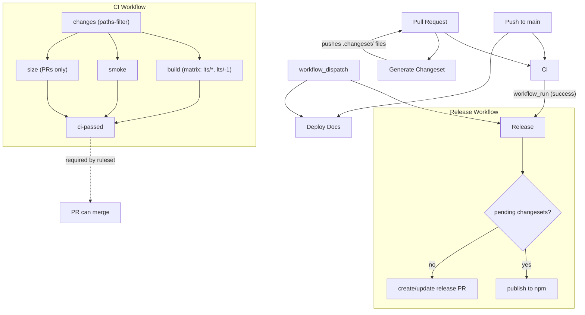
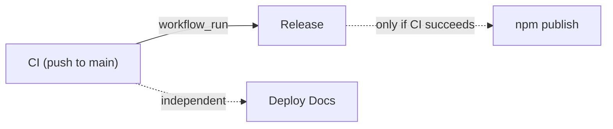

# CI/CD Workflows

## Flow Overview



## Repository Ruleset

Branch protection is a **repository ruleset** with a single required status check: **`CI passed`** (the `ci-passed` job in `ci.yml`). That job runs after `changes`, `build`, `smoke`, and `size`, and succeeds when each upstream job is either `success` or `skipped` — only `failure` or `cancelled` makes it fail.

This means doc-only or meta-only PRs (where the build / smoke / size jobs are skipped via paths-filter gating) still produce a passing `CI passed` check and can merge. Code-changing PRs wait for the real jobs to complete before `CI passed` resolves.

> **Ruleset name:** `Main Branch CI` — manage at Settings > Rules > Rulesets

## Workflows

| Workflow | File | Triggers | Purpose |
|---|---|---|---|
| **CI** | `ci.yml` | push to `main`, pull requests | Build matrix, lint, test, typecheck, smoke (Playwright), bundle size, gated by `ci-passed` |
| **Release** | `release.yml` | after CI succeeds on `main`, manual | Publish packages to npm via changesets |
| **Deploy Docs** | `docs.yml` | push to `main`, manual | Build and deploy Starlight docs to GitHub Pages |
| **Generate Changeset** | `changeset.yml` | pull requests (opened, synchronize) | Auto-generate changeset files with Copilot enhancement |

## Path Filtering (CI)

The `changes` job uses [`dorny/paths-filter`](https://github.com/dorny/paths-filter) to bucket the PR diff (or the latest push's diff). Each bucket is a boolean output consumed by downstream jobs.

| Bucket | Patterns |
|---|---|
| `code` | `packages/**`, `minis/**`, `package.json`, `pnpm-lock.yaml`, `pnpm-workspace.yaml`, `turbo.json`, `tsconfig*.json`, `eslint.config.*`, `vitest.config.*` |
| `examples` | `examples/**`, `e2e/**`, `playwright.config.*` |
| `docs` | `docs/**` |
| `ci` | `.github/workflows/**` |

Job gating:

| Job | Runs when |
|---|---|
| `build` (matrix) | `code` ∨ `ci` |
| `smoke` | `code` ∨ `examples` ∨ `docs` ∨ `ci` (and upstream `build` didn't fail) |
| `size` | `code` ∨ `ci` (PR events only; needs base to diff against) |
| `ci-passed` | always — gates the merge |

A change in `ci` triggers everything so a CI change validates itself.

## Turbo Cache

| Job | Cache key | Notes |
|---|---|---|
| `build (lts/*, current)` | `Linux-turbo-current-${sha}` | Per-node-version namespace |
| `build (lts/-1, previous)` | `Linux-turbo-previous-${sha}` | `pnpm install` resolves different platform deps per node version |
| `smoke` | `Linux-turbo-current-${sha}` | Shares with `current` build leg — primary-key hit |
| `size` | `Linux-turbo-current-${sha}` | Shares with `current` build leg |

Restore-keys mirror the primary key prefix so a fresh SHA inherits from the nearest prior commit's cache via prefix fallback; turbo's content-hashing decides per-task hits.

## Workflow Dependencies



**Release** waits for CI via `workflow_run` and only runs when CI completes successfully on `main`. Manual `workflow_dispatch` bypasses the CI dependency (useful for version corrections).

**Deploy Docs** runs independently of CI on its own trigger.

## Concurrency Controls

| Workflow | Concurrency Group | Behavior |
|---|---|---|
| CI | `ci-{PR number or ref}` | Latest push cancels in-progress run for same PR |
| Release | `Release-refs/heads/main` | Only one release at a time per branch |
| Deploy Docs | `pages` | Latest deploy cancels in-progress deploys |
| Generate Changeset | none | Self-skips via commit message check |

## Manual Triggers

These workflows support `workflow_dispatch` (run from the Actions tab):

- **Release** — Re-run release process without waiting for CI
- **Deploy Docs** — Force a docs redeploy

---

## LLM Prompts

### Updating This Document

Use this prompt after making changes to any workflow file to keep this README in sync:

<details>
<summary>Prompt: Update CI/CD README</summary>

```
Read all workflow files in .github/workflows/ and the current .github/workflows/README.md.

Audit the README against the actual workflow definitions. For each workflow, verify:
- Triggers (on: events, branches) match the documented triggers
- Path-filter bucket patterns and per-job gating match the actual ci.yml `changes` job + downstream `if:` conditions
- Turbo cache key table matches the actual cache key strings used per job
- Workflow dependency graph (mermaid) reflects actual workflow_run chains
- Concurrency groups match actual concurrency config
- Manual triggers section lists all workflows with workflow_dispatch
- Repository ruleset section names the actual required check (the ci-passed gate job)

Update any sections that are out of date. Add new workflows if any exist that aren't documented. Remove documentation for workflows that no longer exist.

Preserve the existing document structure:
1. Flow Overview (mermaid graph)
2. Repository Ruleset
3. Workflows table
4. Path Filtering (bucket table + per-job gating)
5. Turbo Cache (key table)
6. Workflow Dependencies (mermaid graph)
7. Concurrency Controls
8. Manual Triggers

Keep tables, mermaid graphs, and descriptions concise. Do not add commentary outside the established format.
```

</details>

### Implementing CI Changes

Use this prompt when adding new workflows, modifying triggers, or changing the CI architecture:

<details>
<summary>Prompt: CI/CD Implementation Guide</summary>

```
You are implementing CI/CD changes for a GitHub Actions monorepo. Before making changes, read:
- .github/workflows/README.md — full architecture reference
- All .github/workflows/*.yml files — current workflow definitions
- CLAUDE.md — project structure and build commands

Follow these rules when modifying or creating workflows:

BRANCH PROTECTION
- The repository ruleset requires ONE status check: `CI passed` (the ci-passed job in ci.yml)
- ci-passed runs `if: always()`, needs [changes, build, smoke, size], and succeeds when each upstream job is success or skipped (fails only on failure or cancelled)
- New jobs that should block merge must be added to ci-passed's `needs` AND its gate-check loop
- Do NOT introduce per-job required checks in the ruleset — ci-passed is the single gate

PATH FILTERING & JOB GATING
- The changes job in ci.yml uses dorny/paths-filter@v3 to emit per-bucket booleans: code, examples, docs, ci
- Downstream jobs gate via `if:` expressions on those bucket outputs
- A bucket change in `ci` (.github/workflows/**) triggers everything so a CI change validates itself
- When adding a new job, decide which bucket(s) should trigger it and write the `if:` accordingly
- When adding a new top-level directory, add it to the appropriate bucket pattern in the changes job

JOB DEPENDENCIES & SMOKE / SIZE
- smoke and size both `needs: [changes, build]` and use `if: !cancelled() && needs.build.result != 'failure' && (bucket conditions)` — this lets them run when build is skipped (e.g., docs-only PRs) but skips them when build fails
- New jobs that depend on built artifacts should follow the same pattern

TURBO CACHE
- Per-node-version cache namespace: `${{ runner.os }}-turbo-${{ matrix.node-tag }}-${{ github.sha }}` in the build matrix
- Smoke, size, and any new single-node-version job pin to the `current` leg's namespace: `${{ runner.os }}-turbo-current-${{ github.sha }}`
- Restore-keys use the same prefix so prefix-fallback inherits from prior SHAs; turbo content-hashing decides per-task hits

WORKFLOW DEPENDENCIES
- Use workflow_run to chain workflows that must wait for another to complete
- Always add if: github.event.workflow_run.conclusion == 'success' to skip on upstream failure
- If the workflow also supports manual trigger, use: if: github.event_name == 'workflow_dispatch' || github.event.workflow_run.conclusion == 'success'

CONCURRENCY
- Use concurrency groups to prevent duplicate runs of the same workflow
- For deploy workflows, use cancel-in-progress: true
- For release workflows, do NOT cancel in progress — let the current release finish

CONVENTIONS
- actions/checkout@v6, actions/setup-node@v5, actions/cache@v5, actions/upload-artifact@v5, pnpm/action-setup@v5
- setup-node: `node-version: lts/*` and `cache: pnpm`
- pnpm install --frozen-lockfile
- Name jobs clearly — the job name appears in GitHub UI status checks

AFTER MAKING CHANGES
- Update .github/workflows/README.md to reflect all changes (path-filter buckets, gating, dependencies, concurrency, cache keys)
- Verify both mermaid graphs still accurately represent the workflow topology
```

</details>
