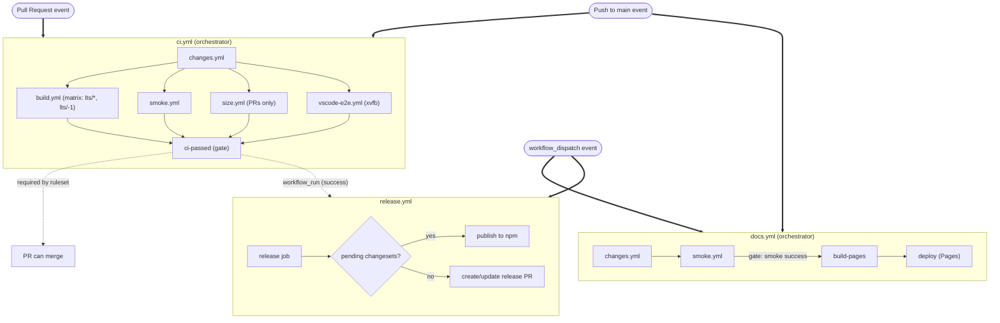
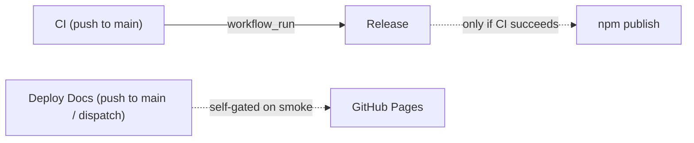

# CI/CD Workflows

## Flow Overview


```mermaid
graph TD
    PR(["Pull Request event"])
    Push(["Push to main event"])
    Manual(["workflow_dispatch event"])

    subgraph CIOrch ["ci.yml (orchestrator)"]
        CIChanges["changes.yml"]
        CIChanges --> CIBuild["build.yml (matrix: lts/*, lts/-1)"]
        CIChanges --> CISmoke["smoke.yml"]
        CIChanges --> CISize["size.yml (PRs only)"]
        CIChanges --> CIVscodeE2E["vscode-e2e.yml (xvfb)"]
        CIBuild --> Gate["ci-passed (gate)"]
        CISmoke --> Gate
        CISize --> Gate
        CIVscodeE2E --> Gate
    end

    subgraph DocsOrch ["docs.yml (orchestrator)"]
        DocsChanges["changes.yml"]
        DocsChanges --> DocsSmoke["smoke.yml"]
        DocsSmoke -->|"gate: smoke success"| BuildPages["build-pages"]
        BuildPages --> DocsDeploy["deploy (Pages)"]
    end

    subgraph ReleaseFlow ["release.yml"]
        Release["release job"]
        Release --> Changesets{"pending changesets?"}
        Changesets -->|yes| Publish["publish to npm"]
        Changesets -->|no| ReleasePR["create/update release PR"]
    end

    PR ==> CIOrch
    Push ==> CIOrch
    Push ==> DocsOrch
    Manual ==> DocsOrch
    Manual ==> ReleaseFlow

    Gate -.->|"workflow_run (success)"| ReleaseFlow
    Gate -.->|"required by ruleset"| Merge["PR can merge"]
```

**Reading the graph:** rounded nodes are events; rectangles are workflows or jobs. Thick arrows (`==>`) are "this event triggers this workflow." Dotted arrows are dependencies between workflows (workflow_run, ruleset gate). Inside each orchestrator subgraph, the solid arrows are the job dependency chain.

## Composable Layout

`ci.yml` and `docs.yml` are slim orchestrators. The actual work lives in reusable workflows that orchestrators call via `uses: ./.github/workflows/<name>.yml`. Each reusable workflow declares `on: workflow_call:` only — they don't trigger directly.

| File             | Role                                                                                                              | Trigger                               |
| ---------------- | ----------------------------------------------------------------------------------------------------------------- | ------------------------------------- |
| `ci.yml`         | Orchestrator: paths-filter → security audit/build matrix → smoke/size/vscode-e2e → gate                           | `push`, `pull_request`                |
| `docs.yml`       | Orchestrator: paths-filter → smoke → build-pages → deploy                                                         | `push` to `main`, `workflow_dispatch` |
| `changes.yml`    | dorny/paths-filter; emits `packages` / `minis` / `examples` / `docs` / `configs` / `vscode` / `ci` bucket outputs | `workflow_call`                       |
| `build.yml`      | Build + typecheck + lint + test + skia test (single node version, takes `node-version` + `node-tag` inputs)       | `workflow_call`                       |
| `smoke.yml`      | Playwright smoke tests against built docs site                                                                    | `workflow_call`                       |
| `size.yml`       | Bundle size diff via size-limit; comments on PR                                                                   | `workflow_call`                       |
| `vscode-e2e.yml` | VS Code extension e2e (real Electron build under Playwright, via `xvfb-run`)                                      | `workflow_call`                       |
| `changeset.yml`  | Dormant generator reference; intentionally not called by an orchestrator                                          | `workflow_call`                       |

The matrix lives at the orchestrator layer (`ci.yml`) — `build.yml` is single-node and reusable. Release could call it directly for a clean publish build if we ever want to dedupe `release.yml`.

## Repository Ruleset

Branch protection is a **repository ruleset** with a single required status check: **`CI passed`** (the `ci-passed` job in `ci.yml`). That job runs after `changes`, `security-audit`, `build`, `smoke`, `size`, and `vscode-e2e`, and succeeds when each upstream job is either `success` or `skipped` — only `failure` or `cancelled` makes it fail.

Doc-only or meta-only PRs (where build / smoke / size / vscode-e2e are skipped via paths-filter gating) still produce a passing `CI passed` check and can merge. Code-changing PRs wait for the real jobs to complete before `CI passed` resolves.

Changesets are written and committed by the contributor or agent. CI does not
generate them. A manual changeset-only follow-up commit can use the retained
fast path described in [Changeset-only skip](#changeset-only-skip).

> **Ruleset name:** `Main Branch CI` — manage at Settings > Rules > Rulesets

## Workflows

| Workflow                      | File                                                                               | Triggers                                                    | Purpose                                                                                                                                                                                                                                                                                                                                   |
| ----------------------------- | ---------------------------------------------------------------------------------- | ----------------------------------------------------------- | ----------------------------------------------------------------------------------------------------------------------------------------------------------------------------------------------------------------------------------------------------------------------------------------------------------------------------------------- |
| **CI**                        | `ci.yml` (+ `changes.yml`, `build.yml`, `smoke.yml`, `size.yml`, `vscode-e2e.yml`) | push to `main`, pull requests                               | Dependency audit, build matrix, lint, test, typecheck, smoke (Playwright), bundle size, and VS Code extension e2e, gated by `ci-passed`                                                                                                                                    |
| **Release**                   | `release.yml`                                                                      | after CI succeeds on `main`, manual                         | Publishes packages to npm via changesets; when the release bumps the private `@three-flatland/vscode` package, orchestrates the reusable `build-vscode-vsix.yml` (`build-vsix`) then creates the `fl-tools-v<version>` GitHub Release with the universal `.vsix` attached (`attach-vsix`)                                                    |
| **Build VS Code Extension VSIX** | `build-vscode-vsix.yml`                                                          | `workflow_call` (from `release.yml`), manual                | Reusable/composable: builds a native codelens-service binary per platform (6-leg matrix, no cross-compilation — darwin x2, linux x2, win32 x2), merges them into one universal VSIX + audio-play, uploads it as the `vsix` artifact. Does **not** publish — marketplace publishing is manual (see `tools/vscode/PUBLISHING.md`)              |
| **Deploy Docs**               | `docs.yml` (+ `changes.yml`, `smoke.yml`)                                          | push to `main`, manual                                      | Self-gated docs deploy: runs paths-filter + smoke before building the Pages artifact and deploying                                                                                                                                                                                                                                        |

## Path Filtering (CI)

`changes.yml` uses [`dorny/paths-filter`](https://github.com/dorny/paths-filter) to bucket the PR diff (or the latest push's diff). Each bucket is a boolean output consumed by downstream jobs in `ci.yml` and `docs.yml`.

| Bucket     | Patterns                                                                                                                                    |
| ---------- | ------------------------------------------------------------------------------------------------------------------------------------------- |
| `packages` | `packages/**`, `skills/**`                                                                                                                  |
| `minis`    | `minis/**`                                                                                                                                  |
| `examples` | `examples/**`, `e2e/**`, `playwright.config.*`                                                                                              |
| `docs`     | `docs/**`                                                                                                                                   |
| `configs`  | `package.json`, `pnpm-lock.yaml`, `pnpm-workspace.yaml`, `nx.json`, `tsconfig*.json`, `.oxlintrc.json`, `.oxfmtrc.json`, `vitest.config.*`, `scripts/**` |
| `vscode`   | `tools/**`                                                                                                                                  |
| `ci`       | `.github/workflows/**`                                                                                                                      |

(`skills/` is `@three-flatland/skills`, a publishable workspace package outside `packages/`. `scripts/` contains CI verification helpers, size-limit, changeset generator, and a vitest-collected test — all affect build behavior, so they live in `configs`. `vscode` covers all of `tools/` — not just `tools/vscode/` itself, since the extension's e2e build pulls in its `workspace:*` siblings there too — `tools/bridge`, `tools/design-system`, `tools/preview`, `tools/io`.)

Job gating:

| Job                                | Runs when                                                                                                                                                                                                                                                                                                                                                                                                              |
| ---------------------------------- | ---------------------------------------------------------------------------------------------------------------------------------------------------------------------------------------------------------------------------------------------------------------------------------------------------------------------------------------------------------------------------------------------------------------------- |
| `ci.security-audit`                | every run — audits the resolved lockfile at moderate severity or higher, including changeset-only updates                                                                                                                                                                                                                                                                                                             |
| `ci.build` (matrix)                | `packages` ∨ `minis` ∨ `examples` ∨ `docs` ∨ `configs` ∨ `vscode` ∨ `ci` — lint/typecheck/test are too valuable to bucket-gate; Nx cache makes the no-ops cheap                                                                                                                                                                                                                                                     |
| `ci.smoke`                         | `packages` ∨ `minis` ∨ `examples` ∨ `docs` ∨ `configs` ∨ `ci` (and upstream `build` didn't fail)                                                                                                                                                                                                                                                                                                                       |
| `ci.size`                          | `packages` ∨ `configs` ∨ `ci` (PR events only; size-limit only tracks published packages)                                                                                                                                                                                                                                                                                                                              |
| `ci.vscode-e2e`                    | `vscode` ∨ `packages` ∨ `ci` (and upstream `build` didn't fail) — real VS Code (Electron) launched under Playwright via `xvfb-run`, see `tools/vscode/e2e/README.md`. `packages` is included because the extension's real `workspace:*` dependency closure reaches into `packages/schemas`, `packages/normals`, `packages/bake`, `packages/image`, `packages/atlas`, and `three-flatland` itself — not just `tools/**` |
| `ci-passed`                        | always — gates the merge                                                                                                                                                                                                                                                                                                                                                                                               |
| `docs.smoke`                       | `packages` ∨ `minis` ∨ `examples` ∨ `docs` ∨ `configs` ∨ `ci` — docs:build pulls in all of them (API reference from `packages`, showcases from `minis`, embedded demos from `examples`)                                                                                                                                                                                                                                |
| `docs.build-pages` / `docs.deploy` | gated on `docs.smoke` success                                                                                                                                                                                                                                                                                                                                                                                          |

A change in `ci` or `configs` triggers everything — CI/config changes need to validate themselves.

### Changeset-only skip

When a contributor or agent pushes a follow-up commit whose delta contains only
`.changeset/` files, that run has nothing to build, so `changes.yml` emits
`changeset_only`:

- On a `pull_request` synchronize, it compares the pushed delta (`before...after` via the compare API). If **every** changed file is under `.changeset/` **and** the base commit's `CI passed` was green, `changeset_only = true`.
- `build` / `smoke` / `size` gate on `changeset_only != 'true'`, so they skip; `ci-passed` (skipped = success) resolves green in seconds instead of re-running the full pipeline.

The flag keys on the **file delta**, not the commit message, so it cannot be
spoofed. The base-passed guard means a changeset stacked on a red commit never
gets green-lit. This is an optimization for manual release metadata, not an
automatic changeset generator.

## Node Version Policy

| Slot     | Resolves to (May 2026) | Purpose                                                                                                 |
| -------- | ---------------------- | ------------------------------------------------------------------------------------------------------- |
| `lts/*`  | Node 22                | Release target. `release.yml` ships from this.                                                          |
| `lts/-1` | Node 20                | Compatibility canary. Catches breakage for users on the older still-supported LTS before it bites them. |

`package.json` declares `engines.node: >=20.0.0`, matching the older end of the matrix.

## Nx Cache

| Job                        | Cache key                     | Notes                                                                                                                                                                                                   |
| -------------------------- | ----------------------------- | ------------------------------------------------------------------------------------------------------------------------------------------------------------------------------------------------------- |
| `build (lts/*, current)`   | `Linux-nx-current-${sha}`  | Per-node-version namespace                                                                                                                                                                              |
| `build (lts/-1, previous)` | `Linux-nx-previous-${sha}` | `pnpm install` resolves different platform deps per node version                                                                                                                                        |
| `smoke`                    | `Linux-nx-current-${sha}`  | Shares with `current` build leg — primary-key hit                                                                                                                                                       |
| `size`                     | `Linux-nx-current-${sha}`  | Shares with `current` build leg                                                                                                                                                                         |
| `vscode-e2e`               | `Linux-nx-current-${sha}`  | Shares with `current` build leg — the job's own `pnpm --filter "@three-flatland/vscode..." -r run build` step (see `tools/vscode/e2e/global-setup.ts`) hits cache for anything `ci.build` already built |
| `release`                  | `Linux-nx-current-${sha}`  | Shares with `current` build leg                                                                                                                                                                         |
| `docs.build-pages`         | `Linux-nx-current-${sha}`  | Shares with `current` build leg; usually a cache hit since `smoke` already built `docs:build`                                                                                                           |

Restore-keys mirror the primary key prefix so a fresh SHA inherits from the nearest prior commit's cache via prefix fallback; nx's content-hashing decides per-task hits.

## Workflow Dependencies


```mermaid
graph LR
    CI["CI (push to main)"] -->|workflow_run| Release
    Release -.->|"only if CI succeeds"| NPM["npm publish"]
    Docs["Deploy Docs (push to main / dispatch)"] -.->|"self-gated on smoke"| Pages["GitHub Pages"]
```

**Release** waits for CI via `workflow_run` and only runs when CI completes successfully on `main`. Manual `workflow_dispatch` bypasses the CI dependency (useful for version corrections).

**Deploy Docs** is self-contained: it runs its own paths-filter + smoke (via the same reusable workflows) before building the Pages artifact and deploying. The deploy is gated on smoke success — `workflow_dispatch` runs the same gate, so hot patches and manual redeploys never bypass validation.

## Concurrency Controls

| Workflow    | Concurrency Group         | Behavior                                                                                                                                                                       |
| ----------- | ------------------------- | ------------------------------------------------------------------------------------------------------------------------------------------------------------------------------ |
| CI          | `ci-{PR number or ref}`   | Latest push cancels the in-progress run for the same PR                                                                                                                       |
| Release     | `Release-refs/heads/main` | Only one release at a time per branch                                                                                                                                          |
| Deploy Docs | `pages`                   | Latest deploy cancels in-progress deploys                                                                                                                                      |

## Manual Triggers

These workflows support `workflow_dispatch` (run from the Actions tab):

- **Release** — Re-run release process without waiting for CI
- **Deploy Docs** — Force a docs redeploy

---

## LLM Prompts

### Updating This Document

Use this prompt after making changes to any workflow file to keep this README in sync:

<details>
<summary>Prompt: Update CI/CD README</summary>

```
Read all workflow files in .github/workflows/ and the current .github/workflows/README.md.

Audit the README against the actual workflow definitions. For each workflow, verify:
- Triggers (on: events, branches, workflow_call) match the documented triggers
- Composable layout table matches the actual files (orchestrator + reusables)
- Path-filter bucket patterns and per-job gating match the actual ci.yml `needs` + `if:` against changes.yml outputs
- Nx cache key table matches the actual cache key strings used per job
- Node version policy table reflects the actual matrix in ci.yml and engines.node in root package.json
- Workflow dependency graph (mermaid) reflects actual workflow_run chains
- Concurrency groups match actual concurrency config
- Manual triggers section lists all workflows with workflow_dispatch
- Repository ruleset section names the actual required check (the ci-passed gate job in ci.yml)

Update any sections that are out of date. Add new workflows if any exist that aren't documented. Remove documentation for workflows that no longer exist.

Preserve the existing document structure:
1. Flow Overview (mermaid graph)
2. Composable Layout
3. Repository Ruleset
4. Workflows table
5. Path Filtering (bucket table + per-job gating)
6. Node Version Policy
7. Nx Cache (key table)
8. Workflow Dependencies (mermaid graph)
9. Concurrency Controls
10. Manual Triggers

Keep tables, mermaid graphs, and descriptions concise. Do not add commentary outside the established format.
```

</details>

### Implementing CI Changes

Use this prompt when adding new workflows, modifying triggers, or changing the CI architecture:

<details>
<summary>Prompt: CI/CD Implementation Guide</summary>

```
You are implementing CI/CD changes for a GitHub Actions monorepo. Before making changes, read:
- .github/workflows/README.md — full architecture reference
- All .github/workflows/*.yml files — current workflow definitions
- AGENTS.md — project structure and build commands

Follow these rules when modifying or creating workflows:

COMPOSABLE LAYOUT
- ci.yml is a slim orchestrator. Real work lives in reusable workflows declared with `on: workflow_call:` only
- Reusable workflows in this repo: changes.yml, build.yml, smoke.yml, size.yml, vscode-e2e.yml, changeset.yml
- The orchestrator calls them via `uses: ./.github/workflows/<name>.yml` and passes inputs/secrets
- New steps that fit an existing reusable workflow go there; otherwise add a new reusable workflow and call it from ci.yml
- Matrix lives at the orchestrator layer — reusable workflows are single-instance and take parameters as inputs

BRANCH PROTECTION
- The repository ruleset requires ONE status check: `CI passed` (the ci-passed job in ci.yml)
- ci-passed runs `if: always()`, needs [changes, build, smoke, size, vscode-e2e], and succeeds when each upstream job is success or skipped (fails only on failure or cancelled)
- New jobs that should block merge must be added to ci-passed's `needs` AND its gate-check loop
- Do NOT introduce per-job required checks in the ruleset — ci-passed is the single gate

PATH FILTERING & JOB GATING
- changes.yml uses dorny/paths-filter@v3 to emit per-bucket booleans: packages, minis, examples, docs, configs, vscode, ci
- Downstream jobs in ci.yml gate via `if:` expressions on those bucket outputs
- A bucket change in `ci` (.github/workflows/**) triggers everything so a CI change validates itself
- When adding a new job, decide which bucket(s) should trigger it and write the `if:` accordingly
- When adding a new top-level directory, add it to the appropriate bucket pattern in changes.yml

JOB DEPENDENCIES & SMOKE / SIZE
- smoke and size both `needs: [changes, build]` and use `if: !cancelled() && needs.build.result != 'failure' && (bucket conditions)` — this lets them run when build is skipped (e.g., docs-only PRs) but skips them when build fails
- New jobs that depend on built artifacts should follow the same pattern

NODE VERSION & MATRIX
- lts/* is the release target (release.yml ships from this); lts/-1 is the compatibility canary
- engines.node in root package.json must match the older end of the matrix (currently >=20.0.0)
- When the LTS schedule rolls (e.g., Node 24 becomes Active LTS), bump engines accordingly

NX CACHE
- Per-node-version cache namespace: `${{ runner.os }}-nx-${{ inputs.node-tag }}-${{ github.sha }}` in build.yml — build.yml OWNS this key and SAVES it (`actions/cache`).
- Smoke, size, vscode-e2e, release, docs, and the commit-skia-libs job pin to the `current` leg's namespace (`${{ runner.os }}-nx-current-${{ github.sha }}`) but RESTORE-ONLY (`actions/cache/restore`) — build is the sole writer of that lineage. Restoring-only avoids the immutable-cache save contention (multiple jobs can't save the same key; they'd just log "already exists") and any cross-workflow race for the same SHA, while still inheriting build's warm cache.
- Restore-keys use the same prefix so prefix-fallback inherits from prior SHAs; nx's content-hashing decides per-task hits

WORKFLOW DEPENDENCIES
- Use workflow_run to chain workflows that must wait for another to complete
- Always add if: github.event.workflow_run.conclusion == 'success' to skip on upstream failure
- If the workflow also supports manual trigger, use: if: github.event_name == 'workflow_dispatch' || github.event.workflow_run.conclusion == 'success'

CONCURRENCY
- Use concurrency groups to prevent duplicate runs of the same workflow
- For deploy workflows, use cancel-in-progress: true
- For release workflows, do NOT cancel in progress — let the current release finish

CONVENTIONS
- actions/checkout@v6, actions/setup-node@v5, actions/cache@v5, actions/upload-artifact@v5, pnpm/action-setup@v5
- setup-node: `node-version: lts/*` and `cache: pnpm` (or pass node-version as input for build.yml)
- pnpm install --frozen-lockfile
- Name jobs clearly — the job name appears in GitHub UI status checks

AFTER MAKING CHANGES
- Update .github/workflows/README.md to reflect all changes (composable layout, path-filter buckets, gating, dependencies, concurrency, cache keys, node policy)
- Verify both mermaid graphs still accurately represent the workflow topology
```

</details>
