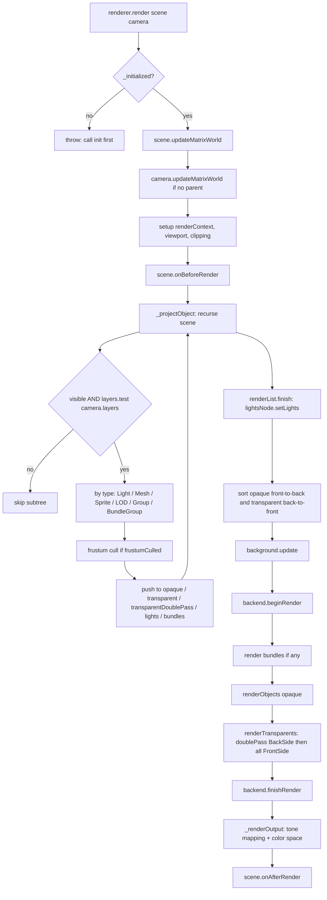
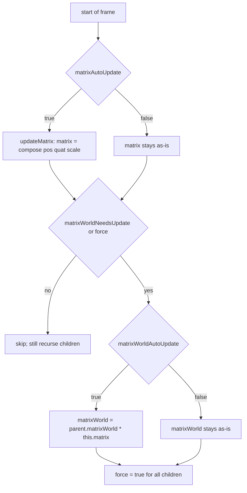

# Idiomatic three.js Patterns (WebGPU)

Three.js r183 reference — **WebGPU-centric**. Assumes `WebGPURenderer` and `NodeMaterial`. The WebGL renderer is not covered here; if you need it, read the 0.183 WebGL docs instead.

> **Import roots** (from `package.json` `exports`):
> - `import { ... } from 'three/webgpu'` — `WebGPURenderer`, all `*NodeMaterial` classes, core `Object3D` subclasses
> - `import { ... } from 'three/tsl'` — TSL factories (`Fn`, `uniform`, `texture`, `vec3`, `positionLocal`, …)
>
> See `tsl-codex.md` for the full TSL language reference.

---

## 1. Core mental model

- `Object3D` is a **passive scene-graph node**. It holds a local transform (`position`, `quaternion`, `scale`) and composes `matrix` from them; `matrixWorld` is its world transform. This is unchanged from the WebGL codebase — `Object3D` lives in `src/core/` and knows nothing about the renderer.
- **Type checking is done by boolean flags**, not `instanceof`: `obj.isMesh`, `obj.isLight`, `obj.isCamera`, `obj.isScene`, and now `mat.isNodeMaterial`. Renderer fast paths branch on these flags.
- **The renderer is asynchronous.** You must `await renderer.init()` before the first `render()` call. Materials compile asynchronously on first use; use `await renderer.compileAsync(scene, camera)` to pre-warm and avoid first-frame hitches (`src/renderers/common/Renderer.js:862`).
- **Shaders are node graphs, not strings.** You do not write WGSL. You compose typed nodes with TSL (`Fn(() => ...)`, `vec3(...).mul(...)`, `positionLocal.add(displacement)`) and the renderer emits WGSL at bind time. There is no `material.onBeforeCompile` in the WebGPU path.
- **GPU resources are not reference counted.** You own geometries, textures, render targets, and node materials. Release them with `.dispose()`; `WebGPURenderer` listens for the `'dispose'` event and frees the GPU-side objects.
- **`copy()` / `clone()` share GPU resources.** Geometry, textures, and node graphs are referenced, not deep cloned. Two cloned meshes share the same compiled pipeline unless you explicitly rebuild the material.

---

## 2. Minimum viable setup

```js
import { WebGPURenderer, Scene, PerspectiveCamera, Mesh, BoxGeometry,
         MeshStandardNodeMaterial } from 'three/webgpu';

const renderer = new WebGPURenderer({ antialias: true });
document.body.appendChild( renderer.domElement );

// REQUIRED — renderer.render() throws if not initialized.
// See src/renderers/common/Renderer.js:1267 (`_initialized` check).
await renderer.init();

const scene = new Scene();
const camera = new PerspectiveCamera( 60, innerWidth / innerHeight, 0.1, 100 );
camera.position.set( 0, 0, 5 );

const mesh = new Mesh( new BoxGeometry(), new MeshStandardNodeMaterial() );
scene.add( mesh );

// Pre-compile pipelines (optional but avoids first-frame stall).
await renderer.compileAsync( scene, camera );

renderer.setAnimationLoop( () => {
  renderer.render( scene, camera );   // synchronous; queues GPU work
} );
```

Rules:
- **`renderer.render()` is synchronous** — it queues GPU commands and returns immediately. It does **not** return a Promise. If you need GPU completion, use `renderer.resolveTimestampsAsync()` or `renderer.getArrayBufferAsync(attribute)`.
- **`setAnimationLoop()` handles XR, `requestAnimationFrame`, and init sequencing.** Prefer it over raw `rAF`.
- **`renderAsync()` is deprecated** in r183 — it only calls `init()` then `render()`. Use explicit `await init()` + `render()` instead.

---

## 3. Subclass construction contract

Same contract as the WebGL path — core `Object3D` is renderer-agnostic. Every renderable subclass follows the same boilerplate:

```js
class MyThing extends Mesh {            // pick the most specific base class
  constructor( geometry, material ) {
    super( geometry, material );        // pass through to base
    this.isMyThing = true;              // fast type flag (NOT prototype)
    this.type = 'MyThing';              // string identity for toJSON
  }

  copy( source, recursive ) {
    super.copy( source, recursive );
    // copy your own fields; do NOT deep-clone geometry/material
    return this;
  }
}
```

Rules:
- `isXxx` is an **instance property set in the constructor**, not on the prototype. The renderer and node library detect subclasses via these flags.
- `.type` is a string used by `toJSON`, `ObjectLoader`, and the debugger. Match the class name.
- Never override `clone()`; override `copy()` and let `Object3D.clone()` dispatch to it (`src/core/Object3D.js:1571-1573`).
- For `NodeMaterial` subclasses, `copy()` must also copy every `*Node` field. See `src/materials/nodes/MeshPhysicalNodeMaterial.js:491-513` for the canonical pattern.

---

## 4. The WebGPU render pipeline



**Canonical call sequence** (`src/renderers/common/Renderer.js`, line numbers are r183):

1. **`render(scene, camera)`** entry (1265). Throws if `_initialized === false` (1267).
2. `scene.updateMatrixWorld()` once per frame if `scene.matrixWorldAutoUpdate` (1508).
3. `camera.updateMatrixWorld()` if the camera has no parent (1510).
4. XR camera override if in XR session (1515).
5. Viewport, scissor, clipping context setup (1542-1555).
6. **`scene.onBeforeRender( renderer, scene, camera, renderTarget )`** (1559).
7. `renderList = this._renderLists.get(scene, camera)` + `renderList.begin()` (1572-1573).
8. **`_projectObject(scene, 0, renderList, clippingContext)`** (1575) — recursive depth-first traversal that fills the render lists. See `_projectObject` around 2901-3020 for the type dispatch on `isLight`, `isMesh`, `isLine`, `isSprite`, `isBundleGroup`, etc.
9. `renderList.finish()` (1577) — calls `lightsNode.setLights(lightsArray)`, binding the collected lights into the node graph.
10. Sort render items (1579-1583): opaque by painter (front-to-back), transparent and transparentDoublePass by reversePainter (back-to-front).
11. Render target + render context setup (1589-1610).
12. `_background.update(scene, renderList, renderContext)` (1636) — prepares clear color or background skybox node.
13. `backend.beginRender(renderContext)` (1641) — opens the GPU pass.
14. If any bundles exist: `_renderBundles(bundles, scene, lightsNode)` (1653) — see §7.
15. `_renderObjects(opaqueObjects, camera, scene, lightsNode)` (1654) if `renderer.opaque === true`.
16. **`_renderTransparents(transparentObjects, transparentDoublePass, camera, scene, lightsNode)`** (1655). If `transparentDoublePass` is non-empty, those items render BackSide first, then all transparent items render FrontSide.
17. `backend.finishRender(renderContext)` (1659) — closes the GPU pass.
18. If a framebuffer target was used for tone mapping/color space: `_renderOutput(renderTarget)` renders a full-screen quad with the output node (1673-1679, 1712-1737).
19. **`scene.onAfterRender( renderer, scene, camera, renderTarget )`** (1683).

**Per-object inner loop** (`renderObject` → `_renderObjectDirect`, ~3239-3410):

1. `object.onBeforeRender(renderer, scene, camera, geometry, material, group)` (3249).
2. Material override logic (3253-3299) — handles `scene.overrideMaterial`, shadow pass material, and the double-pass transparent split (3303-3317).
3. Get or create `RenderObject` via `this._objects.get(...)` (3365).
4. Update nodes + bindings + geometry + pipeline (3381-3410).
5. `backend.draw(renderObject)` (3410).
6. `object.onAfterRender(renderer, scene, camera, geometry, material, group)` (3332).

---

## 5. Lifecycle hook firing order

| Hook | Fires | Arguments |
|---|---|---|
| `scene.onBeforeRender` | once/frame, before traversal | `(renderer, scene, camera, renderTarget)` |
| `scene.onBeforeRender` (nested) | once per shadow pass, per light | same — during `ShadowNode.renderShadow`, see §6 |
| `object.onBeforeRender` | per visible object per material group, before the draw | `(renderer, scene, camera, geometry, material, group)` |
| `object.onAfterRender` | per visible object, after the draw | same |
| `scene.onAfterRender` | once/frame, end | `(renderer, scene, camera, renderTarget)` |

**Gone in WebGPU:**
- `onBeforeShadow` / `onAfterShadow` — do not exist on the WebGPU path. Shadow rendering is driven by `ShadowNode.updateBefore` → `ShadowNode.renderShadow`, which simply calls `renderer.render(scene, shadow.camera)` recursively with `scene.overrideMaterial` set to a shadow-pass material (`src/nodes/lighting/ShadowNode.js:655-672`). If you hooked `onBeforeShadow` in WebGL code, migrate that logic into:
  - `material.castShadowNode` — a node that replaces the cast-shadow output
  - `material.castShadowPositionNode` — a node that replaces the vertex position used for shadow casting
  - `material.receivedShadowNode` — a node that modifies received-shadow color/intensity
- `material.onBeforeCompile` — does not exist. Replace it with node plug-in properties (see `custom-threejs-classes.md` §2) or subclass `NodeMaterial` and override `setup()`.
- `customProgramCacheKey` is still there for classic `ShaderMaterial`, but NodeMaterial uses `customProgramCacheKey()` at a different layer — the node graph itself is the cache key.

**Nested render calls are normal.** A shadow pass, a `PassNode` post-processing chain, and a `ReflectorNode` all call `renderer.render()` recursively inside the top-level call. That means your `scene.onBeforeRender` and `scene.onAfterRender` can fire multiple times per frame — once for the main pass, once for each shadow cascade, once per post-processing pass. Key off `renderer.getRenderTarget()` or the passed `renderTarget` argument to distinguish.

---

## 6. Shadows in WebGPU

Shadows are not a top-level render-pipeline step. They are **nodes inside the lighting graph**:

1. When the renderer sets up lighting, `LightsNode` walks the shadow-casting lights and calls their `ShadowNode.updateBefore(frame)` (`src/nodes/lighting/ShadowNode.js:809`).
2. `updateBefore` may call `updateShadow(frame)` (829), which:
   - Saves renderer + scene state (`resetRendererAndSceneState`).
   - Sets `scene.overrideMaterial = getShadowMaterial(light)`.
   - Calls `renderer.setRenderObjectFunction(getShadowRenderObjectFunction(...))`.
   - Calls `renderer.setRenderTarget(shadowMap)`.
   - Calls **`renderer.render(scene, shadow.camera)`** (668) — a recursive render into the shadow map.
   - Restores state, runs VSM blur if applicable (716+).
3. The actual per-object shadow material handling happens in `Renderer._getShadowNodes(material)` (3124) which composes the depth/color/position nodes per material for the shadow pass.

Consequences:
- `renderer.shadowMap.enabled`, `.type` (`PCFShadowMap` | `VSMShadowMap`), and `.transmitted` control shadow behavior (`Renderer.js:684`).
- To customize shadow casting, set `material.castShadowNode`, `material.castShadowPositionNode`, or `material.maskShadowNode`. These are picked up by `_getShadowNodes`.
- If `material.castShadowNode` is set, you **must** also set `renderer.shadowMap.transmitted = true` or you will get a `warnOnce` and incorrect results (`Renderer.js:3151`).
- Shadow cameras have their own layers; if the shadow camera's layer mask is still the default `0xFFFFFFFE === 0`, `updateShadow` copies the main camera's layers (`ShadowNode.js:691-695`).

---

## 7. Render bundles (WebGPU-only caching)

WebGPU supports GPU-level command bundles — pre-recorded draw command sequences that the backend can replay without re-encoding. Three.js exposes this via a `Group` flag:

```js
const staticGroup = new Group();
staticGroup.isBundleGroup = true;     // opt in
staticGroup.version = 0;
scene.add( staticGroup );
// ... add hundreds of static meshes as children
```

Semantics:
- Setting `isBundleGroup = true` on a `Group` makes `_projectObject` route its children's draw calls into a `RenderBundle` cached on the backend (`Renderer.js:2997-3012`).
- The bundle is re-recorded when `bundleGroup.version` changes. Increment it after mutating the subtree (adding/removing children, swapping materials, changing geometry).
- Per-object nodes and bindings still update per frame; only the command-encoding work is cached. Changing uniforms or moving a child **does not** require re-bundling.
- WebGL fallback ignores the flag; rendering still works, just without the command-bundle optimization.

Use for: static geometry with many draw calls (city blocks, instancing alternatives, UI overlays). Avoid for: dynamic subtrees where children are added/removed every few frames — the invalidation overhead cancels the benefit.

---

## 8. Matrix update rules

Unchanged from WebGL — these are core `Object3D` semantics.



- **The renderer calls `scene.updateMatrixWorld()` once per frame** if `scene.matrixWorldAutoUpdate` is true (default). That is the only call you get for free. Shadow and post-processing nested renders do NOT re-update scene matrices — they assume the top-level call already did.
- `updateMatrix()` sets `this.matrix = compose(pos, quat, scale)` and sets `matrixWorldNeedsUpdate = true` (`Object3D.js:1150`).
- `updateMatrixWorld(force)` walks descendants; once a node is updated, `force` becomes true for all its descendants (`Object3D.js:1187`).
- `updateWorldMatrix(updateParents, updateChildren)` is the surgical version — use it when you need a single node's `matrixWorld` fresh without touching the rest of the graph (`Object3D.js:1212`).
- **`Object3D.pivot`** (nullable `Vector3`, `Object3D.js:388, 1137-1148`) offsets rotation/scale around a pivot point. Under-documented; newer addition.

---

## 9. Frustum culling

- Default: `object.frustumCulled = true`.
- Test happens in `_projectObject` for Meshes, Lines, Points, Sprites.
- Uses the object's geometry bounding sphere transformed by `matrixWorld`. The culler does **not** update matrices — whatever was last computed is what gets tested.
- Disable when:
  - A TSL `positionNode` displaces vertices at runtime — the bounding sphere is stale.
  - Screen-space objects (sprites, UI).
  - Skinned meshes with large pose range (or recompute the sphere per frame).
- Shadow-pass culling uses the **shadow camera's** frustum. An object visible in the main camera can be culled out of the shadow pass and vice versa.

---

## 10. Render list sorting

`src/renderers/common/RenderList.js`. Three lists per scene/camera:

| List | Condition | Sort |
|---|---|---|
| `opaque` | not transparent, no transmission, no backdropNode, no transmissionNode | `painterSortStable` — front-to-back (`a.z - b.z`) |
| `transparent` | `transparent` OR `transmission > 0` OR has `transmissionNode` OR has `backdropNode` | `reversePainterSortStable` — back-to-front (`b.z - a.z`) |
| `transparentDoublePass` | subset of transparent where: has transmission AND `side === DoubleSide` AND `forceSinglePass === false` | `reversePainterSortStable` |

Sort keys in order of priority (same for both sort functions):
1. `groupOrder` (`Group.renderOrder` inherited from an ancestor Group)
2. `renderOrder` (`Object3D.renderOrder`)
3. `z` (projected depth; ascending for opaque, descending for transparent)
4. `id` (stable tiebreaker)

Non-obvious:
- **`transparentDoublePass` is transmission-only.** Classic "transparent DoubleSide" without transmission is not dual-passed in WebGPU. This differs from WebGL, where any `transparent && DoubleSide && !forceSinglePass` material was dual-passed.
- **Opaque does not batch by material id**, unlike WebGL. The WebGPU render list relies on the GPU's pipeline cache to dedupe state changes.
- `Group.renderOrder` still propagates as `groupOrder` to children during `_projectObject`.
- `renderer.opaque = false` or `renderer.transparent = false` disables a whole list. Useful for layered rendering.

---

## 11. Raycast contract

Unchanged from WebGL — `Raycaster` lives in `src/core/Raycaster.js` and uses `object.raycast(raycaster, intersects)` hooks on each subclass. See the summary below; full details are in `common-patterns-and-helpers.md` §8.

- `Raycaster` does **not** call `updateMatrixWorld`. If you raycast outside the render loop, call `scene.updateMatrixWorld()` first.
- `Mesh.raycast` uses `geometry.boundingSphere` → `geometry.boundingBox` → triangles. Mutating vertex positions requires `computeBoundingSphere()`/`computeBoundingBox()`.
- **If you use a `positionNode` to displace vertices on the GPU, raycasts still use the CPU-side geometry positions**. Either keep a CPU mirror, raycast against a proxy geometry, or use GPU picking.
- `raycaster.layers` and `object.layers` must share a bit.

---

## 12. Scene graph API

Unchanged from WebGL — core `Object3D`.

- `parent.add(child)` / `parent.remove(child)`: reparents; does NOT preserve world transform.
- `parent.attach(child)`: reparents **and preserves world transform** (`Object3D.js:874-907`).
- `object.removeFromParent()` / `object.clear()`.
- `traverse(cb)`: depth-first over **all** descendants including self.
- `traverseVisible(cb)`: same but skips invisible subtrees.
- `traverseAncestors(cb)`: walks up to the scene root.
- `'added'` / `'removed'` events on the child; `'childadded'` / `'childremoved'` on the parent. Events reuse static objects; **do not retain them** inside listeners.

---

## 13. Non-obvious gotchas

1. **`render()` is synchronous and does not return a Promise.** GPU work is queued. If you need GPU completion for a readback, use `renderer.resolveTimestampsAsync()` or `renderer.getArrayBufferAsync(storageAttribute)`. (`Renderer.js:1265`)
2. **Forgetting `await renderer.init()` will throw** on first `render()`. The error message says `"initialize the renderer before calling render()"`. (`Renderer.js:1267`)
3. **`compileAsync(scene, camera)` is not mandatory but highly recommended.** Without it, first use of any material stalls the frame on shader compilation. Call it after scene setup and before entering the render loop. (`Renderer.js:862`)
4. **Shadow passes call `renderer.render()` recursively.** `scene.onBeforeRender` / `scene.onAfterRender` can fire multiple times per frame — once per shadow cascade. Distinguish by checking `renderer.getRenderTarget()`.
5. **`onBeforeShadow` / `onAfterShadow` do not exist.** Use `material.castShadowNode` / `material.castShadowPositionNode` / `material.maskShadowNode` / `material.receivedShadowNode` instead. See `common-patterns-and-helpers.md` §6.
6. **`onBeforeCompile` does not exist.** Use NodeMaterial plug-in properties or subclass `NodeMaterial` and override `setup()`. See `custom-threejs-classes.md` §2.
7. **Transparent DoubleSide without transmission is NOT dual-passed** in WebGPU. If you relied on the WebGL trick where `transparent + DoubleSide + !forceSinglePass` ran both faces, migrate to transmission (for glass) or accept the single-pass behavior.
8. **`material.transmission > 0` (or `transmissionNode`) triggers a transmission pass.** The pass captures the scene into a texture and samples it back for glass-like refraction. This is expensive; set `material.forceSinglePass = true` to skip it for DoubleSide.
9. **`BundleGroup.version++` is manual.** Three.js does not watch the subtree for changes. Adding/removing a child does not invalidate the bundle automatically; increment `version` yourself.
10. **`renderer.setRenderObjectFunction()` is a global override** — it remains set until cleared. Shadow nodes save and restore it around their own override. If you set your own, save the previous one first and restore it in a try/finally.
11. **Frustum culling uses the CPU-side bounding sphere.** A TSL `positionNode` that displaces vertices will cause popping at the frustum edges. Set `frustumCulled = false` or grow the bounding sphere.
12. **Cameras strip scale from `matrixWorldInverse`** (`Camera.js:112-150`). Parenting a camera under a scaled node works visually, but `camera.getWorldScale` will not reflect the effective scale.

---

## 14. Anti-patterns

- **Using `instanceof` for hot type checks.** Use `obj.isMesh`, `mat.isNodeMaterial`, etc. — faster and survives dual-bundled three.js copies.
- **Deep cloning materials hoping for independent GPU pipelines.** Clones share the underlying node graph and compiled pipeline. Changing the clone's `colorNode` forces a rebuild, but until you do, they are one pipeline.
- **Writing `ShaderMaterial` for WebGPU.** Classic `ShaderMaterial` is WebGL-only. WebGPURenderer's `NodeLibrary.fromMaterial` auto-upgrades `MeshBasicMaterial` and friends (`src/renderers/common/nodes/NodeLibrary.js:52-74`), but `ShaderMaterial` has no node-material equivalent and will either crash or fall back. Write `NodeMaterial` subclasses from the start.
- **Allocating `Vector3` / `Matrix4` inside `onBeforeRender`, `update`, or TSL `Fn()` callbacks.** Hot loops. Hoist scratch values to module scope or closure.
- **Calling `renderer.render()` before `await renderer.init()`.** Throws.
- **Forgetting `geometry.computeBoundingSphere()` after mutating positions.** Raycasting and frustum culling break silently.
- **Mutating `geometry.attributes.position.array` without `position.needsUpdate = true`.** The GPU never sees the change. The flag is on the `BufferAttribute`, not the `BufferGeometry`.
- **Putting heavy work in `traverse` callbacks during render.** Traverse walks every descendant including non-visible ones; use `traverseVisible` or cache the traversal result.
- **Assuming `renderer.render()` waits for the GPU.** It does not. For a deterministic readback use the async variants.
- **Setting `material.side = DoubleSide` on every transparent mesh** expecting WebGL's two-pass behavior. Without `transmission`, you get single-pass sorting artifacts. Either accept them, use `forceSinglePass = true` and understand the visual tradeoff, or enable transmission.
