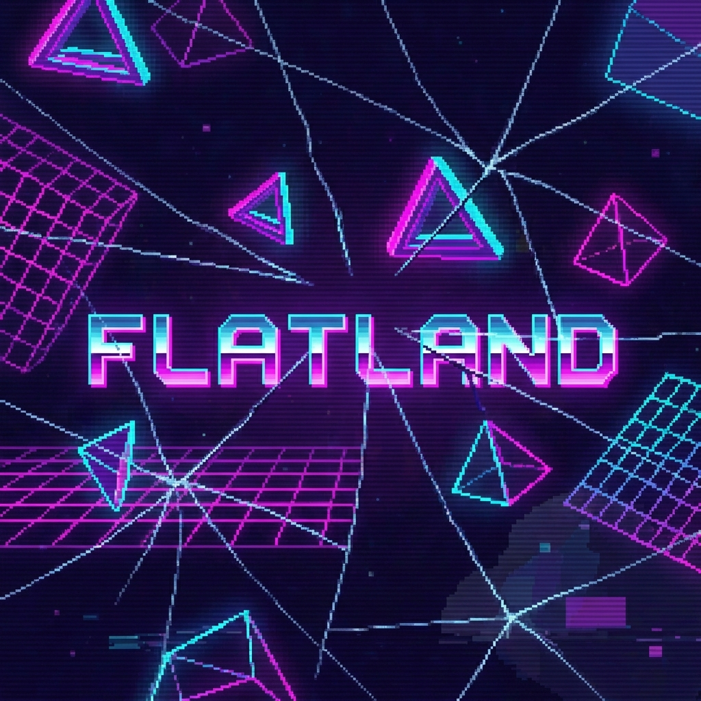

# three-flatland

A TSL-native 2D rendering library for Three.js. High-performance sprites, tilemaps, text, and effects using WebGPU and the Three.js Shading Language.

## Features

- **TSL-Native Shaders** - All effects built with Three.js Shading Language, works on WebGL and WebGPU
- **Automatic Batching** - Sprites with the same material batch into single draw calls automatically
- **Decoupled Scene Graph** - Transform hierarchy and render order are independent (layer + zIndex)
- **Composable Effects** - Build custom effects by composing TSL nodes
- **Tree-Shakeable** - Import only what you use
- **React Three Fiber Support** - First-class R3F integration with Suspense resources

## Installation

```bash
# Core library
npm install @three-flatland/core three

# For React Three Fiber
npm install @three-flatland/react @react-three/fiber react

# Optional: TSL effect nodes
npm install @three-flatland/nodes

# Optional: Pre-configured effect presets
npm install @three-flatland/presets
```

## Quick Start

### Vanilla Three.js

```typescript
import * as THREE from 'three/webgpu'
import { Sprite2D, SpriteSheetLoader, Layers } from '@three-flatland/core'

const renderer = new THREE.WebGPURenderer()
const scene = new THREE.Scene()
const camera = new THREE.OrthographicCamera(0, 800, 600, 0, -1000, 1000)

// Load a spritesheet
const sheet = await SpriteSheetLoader.load('/sprites/player.json')

// Create a sprite
const player = new Sprite2D({
  texture: sheet.texture,
  frame: sheet.getFrame('idle_0'),
  anchor: [0.5, 1], // Bottom center
})
player.position.set(400, 300, 0)
player.layer = Layers.ENTITIES
scene.add(player)

function animate() {
  requestAnimationFrame(animate)
  renderer.render(scene, camera)
}
animate()
```

### React Three Fiber

```tsx
import { Canvas, extend } from '@react-three/fiber/webgpu'
import { Suspense } from 'react'
import { Sprite2D, SpriteSheetLoader, Layers } from '@three-flatland/core'
import type {} from '@three-flatland/react'

extend({ Sprite2D })

const sheet = SpriteSheetLoader.load('/sprites/player.json')

function Player() {
  const spriteSheet = use(sheet)

  return (
    <sprite2D
      texture={spriteSheet.texture}
      frame={spriteSheet.getFrame('idle_0')}
      anchor={[0.5, 1]}
      layer={Layers.ENTITIES}
      position={[400, 300, 0]}
    />
  )
}

function App() {
  return (
    <Canvas orthographic camera={{ position: [400, 300, 100] }}>
      <Suspense fallback={null}>
        <Player />
      </Suspense>
    </Canvas>
  )
}
```

## Core Concepts

### Layers and Z-Ordering

Unlike traditional 3D engines, three-flatland separates transform hierarchy from render order:

```typescript
// Scene graph controls position inheritance
const player = new THREE.Group()
const shadow = new Sprite2D({ texture: shadowTex })
const body = new Sprite2D({ texture: bodyTex })
player.add(shadow, body)

// Render order is explicit and independent
shadow.layer = Layers.SHADOWS  // Renders first
body.layer = Layers.ENTITIES   // Renders on top

// Shadow moves with player but renders below
player.position.x += 10
```

### Material-Based Batching

Sprites automatically batch when sharing the same material:

```typescript
const material = new Sprite2DMaterial({ texture })

// These all batch into one draw call
const sprites = Array.from({ length: 1000 }, () =>
  new Sprite2D({ material })
)
```

For per-sprite effect variations, use instance attributes:

```typescript
const material = new Sprite2DMaterial({ texture })
material.addInstanceFloat('dissolve', 0)

const sprite = new Sprite2D({ material })
sprite.setInstanceValue('dissolve', 0.5)
```

### Animation

Create animated sprites with frame-based animations:

```typescript
import { AnimatedSprite2D, SpriteSheetLoader } from '@three-flatland/core'

const sheet = await SpriteSheetLoader.load('/sprites/player.json')

const player = new AnimatedSprite2D({
  spriteSheet: sheet,
  animationSet: {
    animations: {
      idle: { frames: ['idle_0', 'idle_1', 'idle_2'], fps: 8 },
      run: { frames: ['run_0', 'run_1', 'run_2', 'run_3'], fps: 12 },
      attack: { frames: ['attack_0', 'attack_1'], fps: 15, loop: false },
    },
  },
  animation: 'idle',
})

// In update loop
player.update(deltaMs)

// Change animation
player.play('run')

// Play with callbacks
player.play('attack', {
  onComplete: () => player.play('idle'),
})
```

### TSL Effects

Build effects using Three.js Shading Language:

```typescript
import { hueShift, dissolve, outline } from '@three-flatland/nodes'
import { texture, uv, uniform } from 'three/tsl'

const material = new Sprite2DMaterial({ texture: tex })
material.colorNode = hueShift(
  texture(tex, uv()),
  { amount: uniform(0.5) }
)
```

## Packages

| Package | Description |
|---------|-------------|
| `@three-flatland/core` | Sprites, materials, loaders, render pipeline |
| `@three-flatland/nodes` | TSL shader nodes for effects |
| `@three-flatland/react` | React Three Fiber types and utilities |
| `@three-flatland/presets` | Pre-configured effect combinations |

## Requirements

- **three.js** >= 0.182.0 (TSL/WebGPU support)
- **React** >= 19.0.0 (for `@three-flatland/react`, uses `use()` hook)
- **@react-three/fiber** >= 10.0.0-alpha.0 (for React, WebGPU support)

## Roadmap

- [x] Project setup and monorepo structure
- [x] Core sprite system (Sprite2D, materials, loaders)
- [x] Animation system (AnimatedSprite2D, AnimationController)
- [x] 2D render pipeline with batching
- [x] TSL effect nodes
- [ ] Tilemap support (Tiled, LDtk)
- [ ] Text rendering (SDF, MSDF, bitmap)
- [ ] React Three Fiber integration
- [ ] Render targets for 2D-on-3D
- [ ] Effect presets

## Design Philosophy

three-flatland brings classic 2D game engine workflows to Three.js:

1. **Three.js-First** - Everything is vanilla Three.js, usable without React
2. **Proper 2D Pipeline** - Batched rendering with explicit z-ordering
3. **Scene Graph ≠ Render Order** - Transforms and draw order are decoupled
4. **TSL-Native** - Shaders written in TSL, not GLSL strings
5. **Tree-Shakeable** - Import only what you use

## License

MIT
