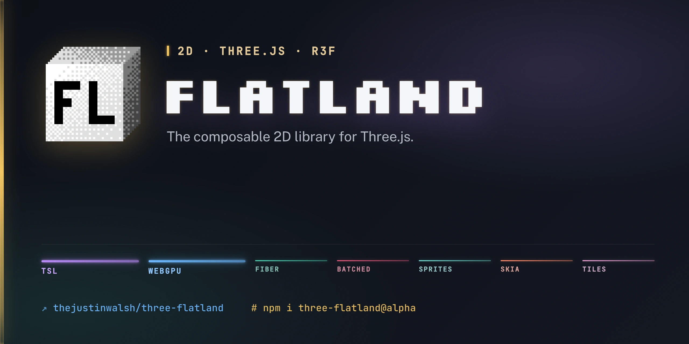

<p align="center">
  
</p>

# three-flatland

High-performance 2D sprites, tilemaps, and effects for Three.js — built for WebGPU with composable TSL shaders.

> [!IMPORTANT]
> **Early Alpha** — three-flatland is in active development. We're exploring performant, maintainable, and extensible patterns for GPU-driven 2D rendering with WebGPU. The API will evolve as we refine these systems. Your feedback shapes what we build.

## Features

- **WebGPU Native** — all shaders built with TSL (Three Shader Language), works on WebGPU and WebGL
- **Automatic Batching** — sprites sharing a material batch into single draw calls
- **Decoupled Scene Graph** — transform hierarchy and render order are independent (layer + zIndex)
- **Composable Effects** — TSL shader nodes for tint, outline, dissolve, CRT, palette swap, and more
- **Animation System** — spritesheet-driven with frame-perfect timing and callbacks
- **Tilemap Support** — Tiled and LDtk editor formats with animated tiles
- **Tree-Shakeable** — import only what you use, deep imports for maximum control
- **React Three Fiber** — first-class R3F integration via `three-flatland/react`

## Installation

```bash
# Core library (Three.js)
npm install three-flatland@alpha three koota

# For React Three Fiber
npm install three-flatland@alpha @react-three/fiber@alpha react react-dom

# TSL shader nodes (optional)
npm install @three-flatland/nodes@alpha
```

## Quick Start

### Three.js

```typescript
import { WebGPURenderer } from 'three/webgpu'
import { Scene, OrthographicCamera } from 'three'
import { Sprite2D, SpriteGroup, TextureLoader } from 'three-flatland'

const scene = new Scene()
const camera = new OrthographicCamera(-400, 400, 300, -300, 0.1, 1000)
camera.position.z = 100

const renderer = new WebGPURenderer()
renderer.setSize(800, 600)
document.body.appendChild(renderer.domElement)
await renderer.init()

const texture = await TextureLoader.load('/sprite.png')

// SpriteGroup handles automatic batching
const group = new SpriteGroup()
scene.add(group)

const sprite = new Sprite2D({ texture, anchor: [0.5, 0.5] })
group.add(sprite)

function animate() {
  requestAnimationFrame(animate)
  renderer.render(scene, camera)
}
animate()
```

### React Three Fiber

```tsx
import { Canvas, extend, useLoader } from '@react-three/fiber/webgpu'
import { Suspense } from 'react'
import { Sprite2D, SpriteGroup, TextureLoader } from 'three-flatland/react'

extend({ Sprite2D, SpriteGroup })

function Sprite() {
  const texture = useLoader(TextureLoader, '/sprite.png')
  return (
    <spriteGroup>
      <sprite2D texture={texture} anchor={[0.5, 0.5]} />
    </spriteGroup>
  )
}

export default function App() {
  return (
    <Canvas orthographic camera={{ zoom: 1, position: [0, 0, 100] }}>
      <Suspense>
        <Sprite />
      </Suspense>
    </Canvas>
  )
}
```

## Core Concepts

### Layers and Z-Ordering

Unlike traditional 3D engines, three-flatland separates transform hierarchy from render order:

```typescript
import { Sprite2D, Layers } from 'three-flatland'

// Scene graph controls position inheritance
const player = new THREE.Group()
const shadow = new Sprite2D({ texture: shadowTex })
const body = new Sprite2D({ texture: bodyTex })
player.add(shadow, body)

// Render order is explicit and independent
shadow.layer = Layers.SHADOWS   // Renders first
body.layer = Layers.ENTITIES    // Renders on top

// Shadow moves with player but always renders below
player.position.x += 10
```

### Animation

```typescript
import { AnimatedSprite2D, SpriteSheetLoader } from 'three-flatland'

const sheet = await SpriteSheetLoader.load('/sprites/player.json')

const player = new AnimatedSprite2D({
  spriteSheet: sheet,
  animationSet: {
    animations: {
      idle: { frames: ['idle_0', 'idle_1', 'idle_2'], fps: 8 },
      run: { frames: ['run_0', 'run_1', 'run_2', 'run_3'], fps: 12 },
      attack: { frames: ['attack_0', 'attack_1'], fps: 15, loop: false },
    },
  },
  animation: 'idle',
})

player.update(deltaMs)
player.play('run')
player.play('attack', { onComplete: () => player.play('idle') })
```

### Composable TSL Effects

```typescript
import { createMaterialEffect } from 'three-flatland'
import { tintAdditive, hueShift } from '@three-flatland/nodes'
import { vec4 } from 'three/tsl'

const DamageFlash = createMaterialEffect({
  name: 'damageFlash',
  schema: { intensity: 1 } as const,
  node: ({ inputColor, attrs }) => {
    const flashed = tintAdditive(inputColor, [1, 1, 1], attrs.intensity)
    return vec4(flashed.rgb.mul(inputColor.a), inputColor.a)
  },
})

const flash = new DamageFlash()
sprite.addEffect(flash)
flash.intensity = 0.8 // Animate per frame
```

## Packages

| Package | Description |
|---------|-------------|
| [`three-flatland`](https://www.npmjs.com/package/three-flatland) | Core library — sprites, materials, animation, loaders, tilemaps, render pipeline |
| [`three-flatland/react`](https://www.npmjs.com/package/three-flatland) | React Three Fiber subpath — re-exports core + JSX type augmentation |
| [`@three-flatland/nodes`](https://www.npmjs.com/package/@three-flatland/nodes) | TSL shader nodes for effects (per-category subpaths) |
| [`@three-flatland/skia`](https://www.npmjs.com/package/@three-flatland/skia) | Skia GPU rendering via WASM — text, paths, and image filters |
| [`@three-flatland/tweakpane`](https://www.npmjs.com/package/@three-flatland/tweakpane) | Tweakpane v4 integration — theme, helpers, and React hooks |
| [`@three-flatland/presets`](https://www.npmjs.com/package/@three-flatland/presets) | Pre-configured effect combinations (coming soon) |

## Requirements

- **three.js** >= 0.183.1 (TSL/WebGPU support)
- **koota** >= 0.6.5 (ECS for batch rendering)
- **React** >= 19.0.0 (for `three-flatland/react`, uses `use()` hook)
- **@react-three/fiber** >= 10.0.0-alpha.2 (for React, WebGPU support)

## Documentation

Full docs, interactive examples, and API reference at **[thejustinwalsh.com/three-flatland](https://thejustinwalsh.com/three-flatland/)**

## Roadmap

- [x] Core sprite system (Sprite2D, materials, loaders)
- [x] Animation system (AnimatedSprite2D, AnimationController)
- [x] 2D render pipeline with automatic batching
- [x] TSL effect nodes (composable shader nodes)
- [x] Tilemap support (Tiled, LDtk)
- [x] React Three Fiber integration
- [x] Skia GPU text rendering via WASM
- [ ] Render targets for 2D-on-3D
- [ ] Effect presets

## License

[MIT](./LICENSE)

---

<sub>This documentation was created with AI assistance. AI can make mistakes — please verify claims and test code examples. Submit corrections [here](https://github.com/thejustinwalsh/three-flatland/issues).</sub>
