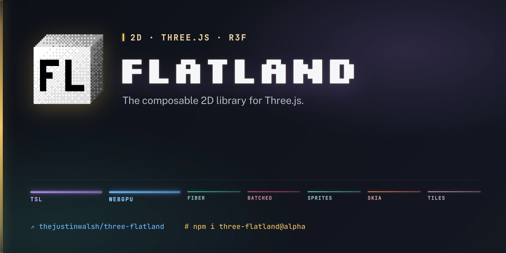

<p align="center">
  
</p>

# three-flatland

2D sprites, tilemaps, and TSL-composable effects for Three.js, built for WebGPU.

> [!IMPORTANT]
> **Alpha** — three-flatland is in active development. The library targets GPU-driven 2D rendering on WebGPU; the API will evolve as the underlying systems settle. Open an issue or comment on [GitHub](https://github.com/thejustinwalsh/three-flatland/issues) to shape what gets built.

## Features

- **2D primitives on the Three.js scene graph.** `Sprite2D`, `AnimatedSprite2D`, `SpriteGroup`, and `TileMap2D` as plain `Object3D` subclasses. Transform hierarchy and render order are independent (`sortLayer` + `zIndex`).
- **TSL-native effect composition.** Effects are TSL node graphs that ride on a shared material. Sprites in a batch stay batched as effects come and go.
- **Effect-aware sprite batching.** Compatible sprites stay batched as effects change, with per-sprite values packed into shared GPU buffers.
- **Spritesheet animation with frame-precise timing.** `AnimationController` handles play/pause/onComplete; declare named animations against a sheet.
- **Tilemap loaders for [Tiled](https://www.mapeditor.org/) and [LDtk](https://ldtk.io/).** Animated tiles supported.
- **Pixel-perfect by default.** `FlatlandConfig` coordinates texture loading, integer camera scale, and projected-pivot snapping; override the whole pipeline or one subsystem.
- **Render to texture for 2D-on-3D.** The `Flatland` class composes a 2D scene with a pixel-perfect orthographic camera and optional `RenderTarget`; sample the result on any 3D material (`mesh.material.map = flatland.texture`).
- **React Three Fiber integration** via `three-flatland/react`. Re-exports the core surface plus JSX type augmentation; `attachEffect` covers the add/remove lifecycle.
- **Tree-shakeable subpath exports.** `three-flatland/sprites`, `/animation`, `/loaders`, `/cameras`, `/config`, `/pipeline`, `/tilemap`, `/materials`. Import only what you use.

## Installation

Scaffold a new project — a Vite-powered WebGPU starter with an interactive sprite scene, tests, and
agent guidance:

```bash
npm create three-flatland@latest my-app -- --template three   # or: --template react
```

Or add the packages to a project you already have:

```bash
# Core library (Three.js)
npm install three-flatland three

# For React Three Fiber
npm install three-flatland @react-three/fiber@10.0.0-alpha.3 react@~19.2.0 react-dom@~19.2.0

# TSL shader nodes
npm install @three-flatland/nodes
```

## Quick Start

### Three.js

```typescript
import { WebGPURenderer } from 'three/webgpu'
import { Scene } from 'three'
import { PixelPerfectCamera, Sprite2D, SpriteGroup, TextureLoader } from 'three-flatland'

const scene = new Scene()
const camera = new PixelPerfectCamera({ viewSize: 600 })

const renderer = new WebGPURenderer()
renderer.setSize(800, 600)
camera.setDrawingBufferSize(renderer.domElement.width, renderer.domElement.height)
renderer.setViewport(camera.getLogicalViewport(renderer.getPixelRatio()))
document.body.appendChild(renderer.domElement)
await renderer.init()

const texture = await TextureLoader.load('/sprite.png')

// SpriteGroup handles automatic batching
const group = new SpriteGroup()
scene.add(group)

const sprite = new Sprite2D({ texture, anchor: [0.5, 0.5] })
group.add(sprite)

function animate() {
  requestAnimationFrame(animate)
  renderer.render(scene, camera)
}
animate()
```

### React Three Fiber

```tsx
import { Canvas, extend, useLoader } from '@react-three/fiber/webgpu'
import { Suspense } from 'react'
import { Sprite2D, SpriteGroup, TextureLoader, usePixelPerfectCamera } from 'three-flatland/react'

extend({ Sprite2D, SpriteGroup })

function Camera() {
  usePixelPerfectCamera({ viewSize: 600 })
  return null
}

function Sprite() {
  const texture = useLoader(TextureLoader, '/sprite.png')
  return (
    <spriteGroup>
      <sprite2D texture={texture} anchor={[0.5, 0.5]} />
    </spriteGroup>
  )
}

export default function App() {
  return (
    <Canvas orthographic>
      <Camera />
      <Suspense>
        <Sprite />
      </Suspense>
    </Canvas>
  )
}
```

## Core Concepts

### Sort layers and z-ordering

Unlike traditional 3D engines, three-flatland separates transform hierarchy from render order:

```typescript
import { SortLayers, Sprite2D } from 'three-flatland'

// Scene graph controls position inheritance
const player = new THREE.Group()
const shadow = new Sprite2D({ texture: shadowTex })
const body = new Sprite2D({ texture: bodyTex })
player.add(shadow, body)

// Render order is explicit and independent
shadow.sortLayer = SortLayers.SHADOWS // Renders first
body.sortLayer = SortLayers.ENTITIES // Renders on top

// Shadow moves with player but always renders below
player.position.x += 10
```

### Animation

```typescript
import { AnimatedSprite2D, SpriteSheetLoader } from 'three-flatland'

const sheet = await SpriteSheetLoader.load('/sprites/player.json')

const player = new AnimatedSprite2D({
  spriteSheet: sheet,
  animationSet: {
    animations: {
      idle: { frames: ['idle_0', 'idle_1', 'idle_2'], fps: 8 },
      run: { frames: ['run_0', 'run_1', 'run_2', 'run_3'], fps: 12 },
      attack: { frames: ['attack_0', 'attack_1'], fps: 15, loop: false },
    },
  },
  animation: 'idle',
})

player.update(deltaMs)
player.play('run')
player.play('attack', { onComplete: () => player.play('idle') })
```

### Composable TSL Effects

```typescript
import { createMaterialEffect } from 'three-flatland'
import { tintAdditive } from '@three-flatland/nodes'
import { vec4 } from 'three/tsl'

const DamageFlash = createMaterialEffect({
  name: 'damageFlash',
  schema: { intensity: 1 } as const,
  node: ({ inputColor, attrs }) => {
    const flashed = tintAdditive(inputColor, [1, 1, 1], attrs.intensity)
    return vec4(flashed.rgb.mul(inputColor.a), inputColor.a)
  },
})

const flash = new DamageFlash()
sprite.addEffect(flash)
flash.intensity = 0.8 // Animate per frame
```

## Packages

| Package                                                                              | Description                                                                      |
| ------------------------------------------------------------------------------------ | -------------------------------------------------------------------------------- |
| [`three-flatland`](https://www.npmjs.com/package/three-flatland) | Default entry. Sprites, animation, tilemaps, materials, lights, events, everyday loaders. |
| [`three-flatland/react`](https://www.npmjs.com/package/three-flatland) | React Three Fiber subpath. Re-exports core plus JSX type augmentation. |
| [`create-three-flatland`](https://www.npmjs.com/package/create-three-flatland) | Project scaffolder. `npm create three-flatland@latest`. |
| [`@three-flatland/nodes`](https://www.npmjs.com/package/@three-flatland/nodes) | A specific 2D shader effect (retro/CRT, blur, distortion, color, upscale) without hand-writing TSL. |
| [`@three-flatland/presets`](https://www.npmjs.com/package/@three-flatland/presets) | Lit sprites working immediately. Thin — `DefaultLightEffect` and `NormalMapProvider`. |
| [`@three-flatland/normals`](https://www.npmjs.com/package/@three-flatland/normals) | Dynamic lighting on flat 2D art without hand-authoring normal maps. |
| [`@three-flatland/atlas`](https://www.npmjs.com/package/@three-flatland/atlas) | Loose sprite PNGs into one draw-call-friendly atlas, optionally polygon-trimmed for overdraw. |
| [`@three-flatland/alphamap`](https://www.npmjs.com/package/@three-flatland/alphamap) | Pixel-perfect pointer hit testing on transparent sprites instead of bounding-box hits. |
| [`@three-flatland/image`](https://www.npmjs.com/package/@three-flatland/image) | PNG/WebP/AVIF/KTX2 encode and decode, plus `Ktx2Loader`. |
| [`@three-flatland/bake`](https://www.npmjs.com/package/@three-flatland/bake) | Offline-bake framework and the `flatland-bake` binary. |
| [`@three-flatland/slug`](https://www.npmjs.com/package/@three-flatland/slug) | Text that stays sharp at any zoom or perspective; thousands of glyphs in one draw call. |
| [`@three-flatland/skia`](https://www.npmjs.com/package/@three-flatland/skia) | Immediate-mode 2D canvas in the scene: arbitrary paths, boolean ops, filters, gradients, images. |
| [`@three-flatland/devtools`](https://www.npmjs.com/package/@three-flatland/devtools) | Live inspection of scene, material, and sprite state. |

## Requirements

- **three** ^0.185.1 (TSL/WebGPU support)
- **React** ~19.2.0 (for `three-flatland/react`, capped below 19.3 by R3F alpha.3)
- **@react-three/fiber** 10.0.0-alpha.3 (for React, WebGPU support)

## Documentation

Full docs, interactive examples, and API reference at **[tjw.dev/three-flatland](https://tjw.dev/three-flatland/)**.

## When not to reach for three-flatland

- **3D scenes.** Use Three.js directly. three-flatland adds nothing for non-2D work and the batching system assumes orthographic-style 2D composition.
- **WebGL-1-only targets.** `WebGPURenderer` can use Three.js's WebGL 2 node backend when WebGPU is unavailable; legacy WebGL 1 is out of scope.
- **DOM-overlay UI.** For HTML UI layered over a canvas, use the DOM. three-flatland is a renderer, not a UI toolkit.

## Roadmap

- [x] Core sprite system (Sprite2D, materials, loaders)
- [x] Animation system (AnimatedSprite2D, AnimationController)
- [x] 2D render pipeline with effect-aware sprite batching
- [x] TSL effect nodes (composable shader nodes)
- [x] Tilemap support (Tiled, LDtk)
- [x] React Three Fiber integration
- [x] Skia GPU text rendering via WASM
- [x] Render targets for 2D-on-3D (via `Flatland` class)
- [x] 2D lighting & shadows (`@three-flatland/presets`, SDF occlusion)
- [x] Slug text rendering (`@three-flatland/slug`)
- [x] Effect presets (`@three-flatland/presets`)
- [x] Offline asset baking (`flatland-bake`, atlases, normal maps, alpha hitmasks)
- [x] Project scaffolder (`npm create three-flatland@latest`)
- [x] VS Code tools (`three-flatland.fl-tools`, alpha)
- [ ] Radiance-cascade global illumination (in development)
- [ ] Particles

## License

[MIT](./LICENSE)
