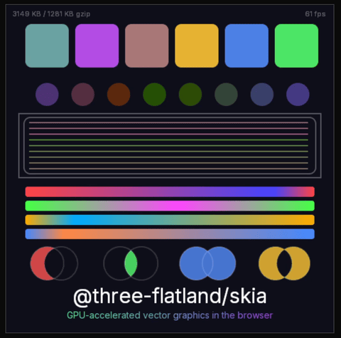

# @three-flatland/skia

A lightweight alternative to [CanvasKit](https://skia.org/docs/user/modules/canvaskit/) &mdash; Skia's core GPU rendering in ~1 MB gzipped, compiled to WebAssembly with Zig.

<p align="center">
  
</p>

## Features

- **GPU-Accelerated Drawing** &mdash; Skia's Ganesh backend renders directly to WebGL2
- **Vector Graphics** &mdash; Paths, fills, strokes, gradients, rounded rects, circles, clipping
- **PathOps** &mdash; Boolean path operations (union, intersect, difference, XOR)
- **SVG** &mdash; Parse and render SVG documents on the GPU
- **Text** &mdash; FreeType glyph rendering with font loading from TTF/OTF data
- **~1 MB brotli** &mdash; less than half the size of CanvasKit
- **60 fps** &mdash; Full scene redraws with animated gradients, text, and PathOps

## Installation

```bash
pnpm add @three-flatland/skia
```

## Building from Source

Requires [Zig](https://ziglang.org/download/) (v0.15.1+). All other tools are downloaded automatically.

```bash
pnpm --filter=@three-flatland/skia skia:setup
```

### Prerequisites

| Tool | Install |
|------|---------|
| Zig 0.15.1 | `brew install zig` (macOS) or [ziglang.org/download](https://ziglang.org/download/) |
| Python 3 | System package manager |
| C, C++ compilers | `xcode-select --install` (macOS) or `build-essential` (Linux) |

WASM toolchain (wasm-tools, wit-bindgen, wasm-opt) is installed locally to `.tools/` with pinned versions and SHA256 verification.

### Browser Test

```bash
npx serve packages/skia -p 3333
open http://localhost:3333/test/browser-test.html
```

## How It Compares to CanvasKit

See [docs/canvaskit-comparison.md](./docs/canvaskit-comparison.md) for a detailed feature matrix, size breakdown, and optimization choices.

## Skia Version

Pinned to Skia **chrome/m147** (Chrome 147 stable release branch).

## License

[MIT](./LICENSE)
