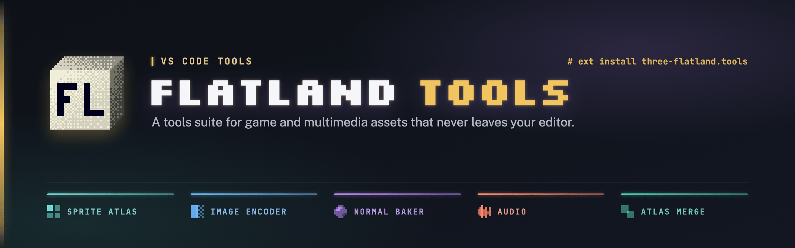
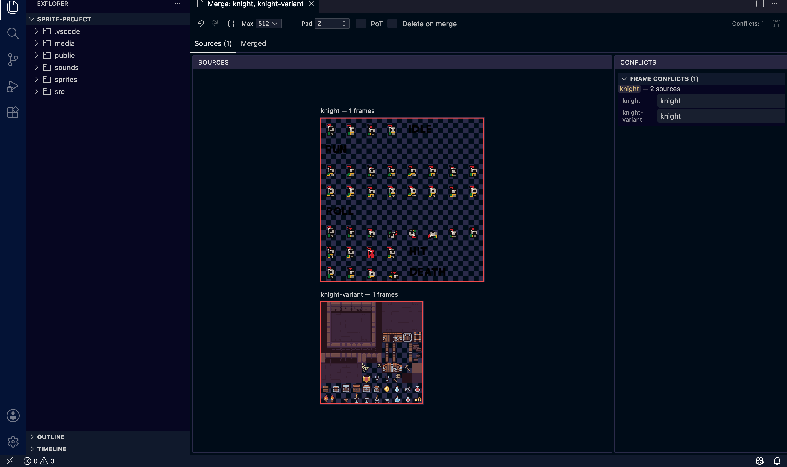
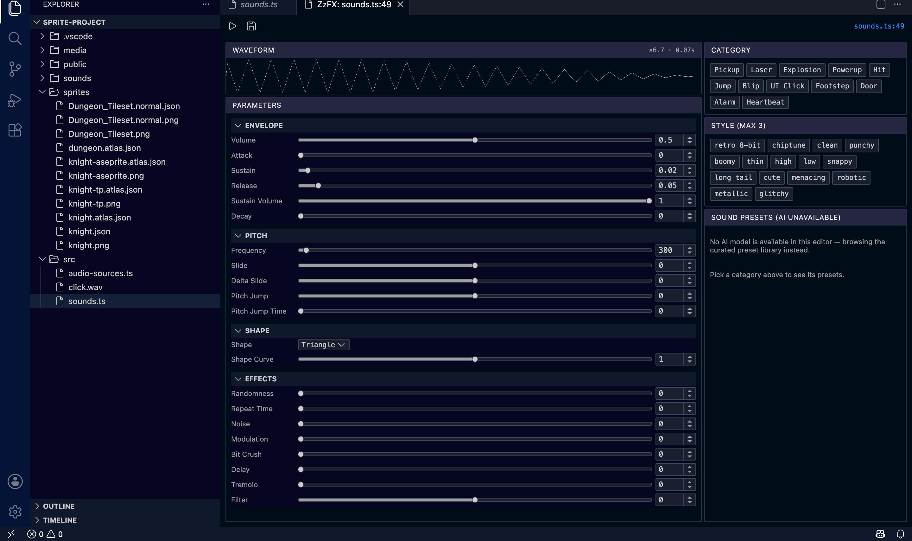

<div align="center">
  

[](https://marketplace.visualstudio.com/items?itemName=three-flatland.tools)
[](https://open-vsx.org/extension/three-flatland/tools)
[](https://github.com/thejustinwalsh/three-flatland/blob/main/LICENSE)

**A tools suite for game and multimedia assets that never leaves your editor.**

Sprite atlas packing · GPU Image encoding · Normal-map baking · Inline audio previews

</div>

---

Built by the team behind [three-flatland](https://github.com/thejustinwalsh/three-flatland), a
WebGPU + TSL 2D sprite/tilemap library for Three.js. Every tool here works standalone; three-flatland
isn't required. If you're building 2D games, interactive graphics, or creative-coding
projects on the web, these editors are for you. Already have a pipeline? FL Sprite Atlas reads and
writes **TexturePacker** and **Aseprite** JSON natively, so switching in is a drop-in, not a
rewrite.

## Tools

###  FL Sprite Atlas

Pack, slice, and animate sprite sheets without leaving VS Code. Draw frames directly on the image,
auto-detect sprites via connected-component analysis, build named animations with a timeline
scrubber, and preview them live.

Reads and writes **TexturePacker** and **Aseprite** JSON export formats natively. Open a file
exported from either tool, see a badge confirming the detected format, and save back in that same
format. Switching output formats warns you before anything lossy happens.


###  FL Image Encoder

Side-by-side comparison encoder for PNG, WebP, AVIF, and KTX2 (Basis Universal: ETC1S/UASTC).
Drag the split slider to compare original vs. encoded, inspect KTX2 mip levels, and see real GPU
memory stats for the encoded result before you commit to a format.


###  FL Normal Baker

Bake normal maps from flat source art. Slice a tileset into regions (grid-aligned or freeform),
assign a direction and elevation per region, and preview the result lit from any angle: normal
and lit views side by side.


###  FL Atlas Merge

Combine multiple `.atlas.json` sprite sheets into one, with conflict resolution for overlapping
frame names.



###  FL Audio

Inline `▶ Play` / `⏹ Stop` CodeLenses appear directly above `zzfx()`, `zzfxm()`, `new Tone.*`, and
`new Wad(...)` calls in your source. Click to hear the sound without leaving your code, backed by
a lightweight background process. No panel opens; nothing interrupts your flow.


###  ZzFX Studio

A dedicated tuner panel for `zzfx()` sound-effect parameters: full envelope, pitch, and shape
controls, a live waveform preview, category/style tags, and AI-assisted preset generation with
history. Opens from the same CodeLens (`⚙ Edit`) when you want to actually shape a sound, not just
hear it.



## Installation

**VS Code Marketplace:**

```
ext install three-flatland.tools
```

Or search **"Flatland Tools"** in the Extensions view (`Cmd+Shift+X` / `Ctrl+Shift+X`).

**Open VSX** (VSCodium, Gitpod, Eclipse Theia, and other VS Code-compatible editors):

Search **"Flatland Tools"** in your editor's extension marketplace, or install directly from
[open-vsx.org](https://open-vsx.org/extension/three-flatland/tools).

## Usage

Every tool is available from the **Flatland Tools** submenu. Right-click a supported file in the
Explorer (`.png`, `.webp`, `.avif`, `.ktx2`, `.atlas.json`, `.normal.json`), or use the Command
Palette.

| Command                 | What it does                                          |
| ----------------------- | ------------------------------------------------------ |
| `Open in Sprite Atlas`  | Pack/slice/animate a sprite sheet                       |
| `Open in Image Encoder` | Compare + encode PNG/WebP/AVIF/KTX2                     |
| `Open in Normal Baker`  | Bake a normal map from source art                       |
| `Merge Atlases…`        | Combine multiple `.atlas.json` sidecars                 |
| `Open ZzFX Editor`      | Full ZzFX Studio tuner panel for a `zzfx()` call        |

FL Audio doesn't have a command to look up: that's the point. Open any file with a `zzfx()`,
`zzfxm()`, `new Tone.*`, or `new Wad(...)` call and `▶ Play` / `⏹ Stop` CodeLenses appear directly
above it. Click to hear it.

Each tool can be individually enabled or disabled under **Settings → Extensions → Flatland Tools**.

## Requirements

No external dependencies. The codelens-service (Rust) and audio-play sidecars ship prebuilt
inside the extension for macOS, Linux, and Windows (x64 and arm64).

## Contributing / Feedback

Issues and feature requests: [GitHub Issues](https://github.com/thejustinwalsh/three-flatland/issues).
This extension is developed in the open as part of the
[three-flatland](https://github.com/thejustinwalsh/three-flatland) monorepo. See
[`tools/vscode`](https://github.com/thejustinwalsh/three-flatland/tree/main/tools/vscode) for
source.

## License

[MIT](https://github.com/thejustinwalsh/three-flatland/blob/main/LICENSE) © Justin Walsh
