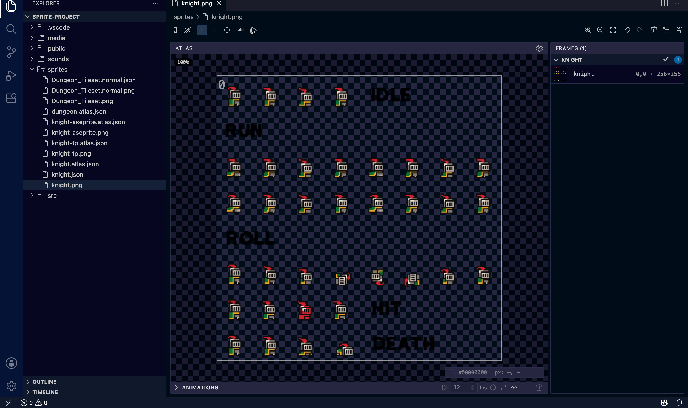
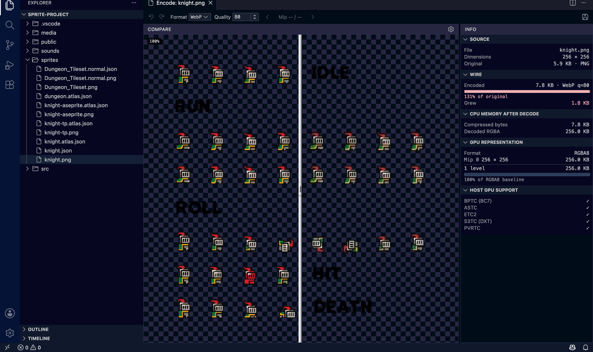
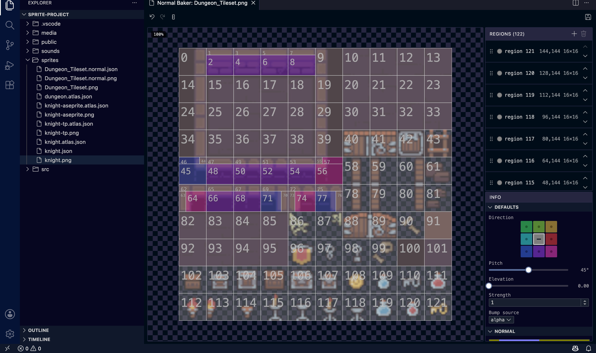

<div align="center">
  

# Flatland Tools

**Visual editors for 2D/WebGPU game assets, right in the editor.**

Sprite atlas packing · Image encoding (PNG/WebP/AVIF/KTX2) · Normal-map baking · Inline audio playback

[](https://marketplace.visualstudio.com/items?itemName=three-flatland.tools)
[](https://open-vsx.org/extension/three-flatland/tools)
[](https://github.com/thejustinwalsh/three-flatland/blob/main/LICENSE)

</div>

---

Built for [three-flatland](https://github.com/thejustinwalsh/three-flatland), a WebGPU + TSL 2D
sprite/tilemap library — but every tool here works standalone on plain PNGs, KTX2 files, and
`.atlas.json` sidecars. You don't need to be using three-flatland to get value from these editors.

## Tools

### 🖼️ FL Sprite Atlas

Pack, slice, and animate sprite sheets without leaving VS Code. Draw frames directly on the image,
auto-detect sprites via connected-component analysis, build named animations with a timeline
scrubber, and preview them live.

Reads and writes **TexturePacker** and **Aseprite** JSON export formats natively — open a file
exported from either tool, see a badge confirming the detected format, and save back in that same
format. Switching output formats warns you before anything lossy happens.



### 🎨 FL Image Encoder

Side-by-side comparison encoder for PNG, WebP, AVIF, and KTX2 (Basis Universal — ETC1S/UASTC).
Drag the split slider to compare original vs. encoded, inspect KTX2 mip levels, and see real GPU
memory stats for the encoded result before you commit to a format.



### 🧭 FL Normal Baker

Bake normal maps from flat source art. Slice a tileset into regions (grid-aligned or freeform),
assign a direction and elevation per region, and preview the result lit from any angle — normal
and lit views side by side.



### 🔀 FL Atlas Merge

Combine multiple `.atlas.json` sprite sheets into one, with conflict resolution for overlapping
frame names.

### 🔊 FL Audio

Inline `▶ Play` / `⏹ Stop` CodeLenses appear directly above `zzfx()`, `zzfxm()`, `new Tone.*`, and
`new Wad(...)` calls in your source — click to hear the sound without leaving your code. Backed by
a lightweight background process (no editor panel needs to open), with a full tuner panel
(**ZzFX Studio**) available for `zzfx()` sound-effect parameters, including AI-assisted preset
generation and waveform preview.


## Installation

**VS Code Marketplace:**

```
ext install three-flatland.tools
```

Or search **"Flatland Tools"** in the Extensions view (`Cmd+Shift+X` / `Ctrl+Shift+X`).

**Open VSX** (VSCodium, Gitpod, Eclipse Theia, and other VS Code-compatible editors):

Search **"Flatland Tools"** in your editor's extension marketplace, or install directly from
[open-vsx.org](https://open-vsx.org/extension/three-flatland/tools).

## Usage

Every tool is available from the **Flatland Tools** submenu — right-click a supported file in the
Explorer (`.png`, `.webp`, `.avif`, `.ktx2`, `.atlas.json`, `.normal.json`) — or via the Command
Palette.

| Command                 | What it does                                                    |
| ----------------------- | --------------------------------------------------------------- |
| `Open in Sprite Atlas`  | Pack/slice/animate a sprite sheet                               |
| `Open in Image Encoder` | Compare + encode PNG/WebP/AVIF/KTX2                             |
| `Open in Normal Baker`  | Bake a normal map from source art                               |
| `Merge Atlases…`        | Combine multiple `.atlas.json` sidecars                         |
| `Open ZzFX Editor`      | Full tuner panel for a `zzfx()` call under the cursor           |
| `Play ZzFX at Cursor`   | Play the `zzfx()` call under the cursor without opening a panel |

Each tool can be individually enabled or disabled under **Settings → Extensions → Flatland Tools**.

## Requirements

No external dependencies — the codelens-service (Rust) and audio-play sidecars ship prebuilt
inside the extension for macOS, Linux, and Windows (x64 and arm64).

## Contributing / Feedback

Issues and feature requests: [GitHub Issues](https://github.com/thejustinwalsh/three-flatland/issues).
This extension is developed in the open as part of the
[three-flatland](https://github.com/thejustinwalsh/three-flatland) monorepo — see
[`tools/vscode`](https://github.com/thejustinwalsh/three-flatland/tree/main/tools/vscode) for
source.

## License

[MIT](https://github.com/thejustinwalsh/three-flatland/blob/main/LICENSE) © Justin Walsh
